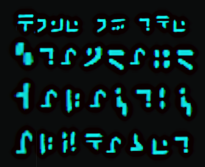

**Home of the [Standard Galactic Alphabet](https://standardgalactic.github.io/alphabet)**
<!-- **Home of the [Standard Galactic Alphabet](https://standardgalactic.github.io/sitemap/fonts/demo.html)** -->

𒋛𒈠 𒃻 𒅗 𒁹

<!--
[Convert this page into Standard Galactic](https://raw.githubusercontent.com/standardgalactic/standardgalactic/refs/heads/main/github-profile.png) *Beta*

[Convert this page into Standard Galactic](https://raw.githubusercontent.com/standardgalactic/standardgalactic/refs/heads/main/year-in-review-2025-chrome.png) *Beta*

[Convert this page into Standard Galactic](https://github.com/standardgalactic/standardgalactic/blob/main/profile-snapshot.png) *Beta*

[Convert this page into Standard Galactic](https://github.com/standardgalactic/standardgalactic/blob/main/github-profile-large-print.png) *Beta*
-->

[Convert this page into Standard Galactic](https://github.com/standardgalactic/standardgalactic/blob/main/banner.png) *Beta*
<!-- 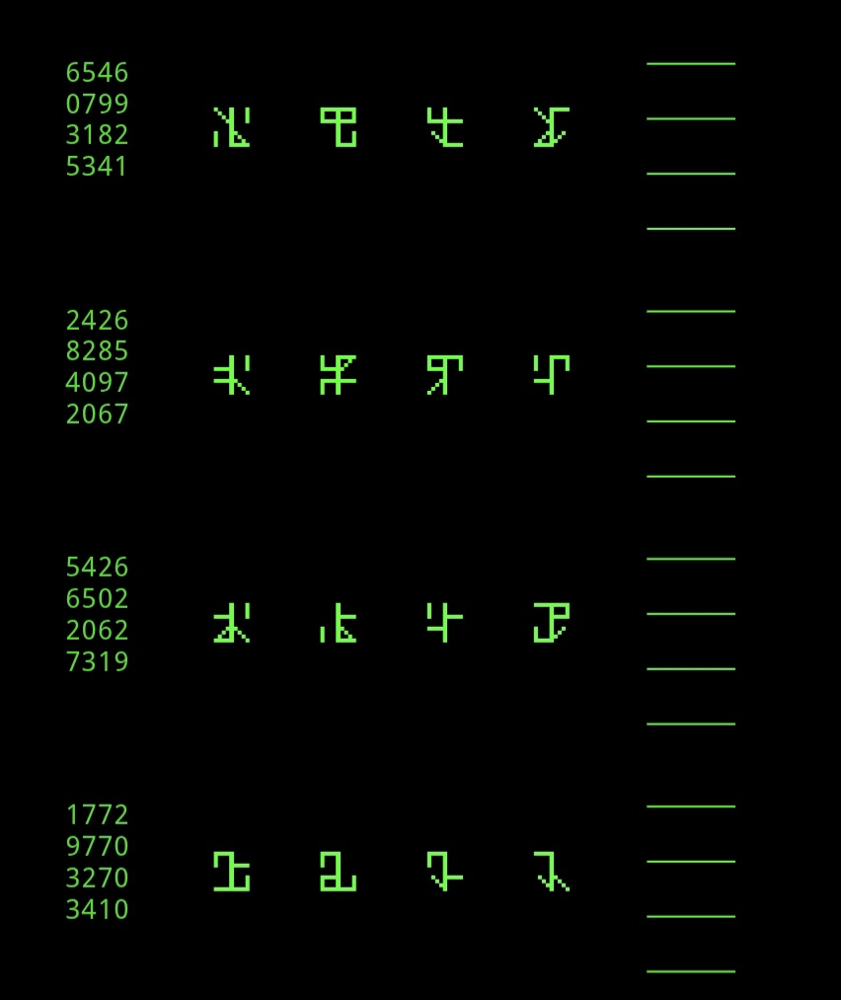 -->

Try the [Cistercian Number Translator](https://standardgalactic.github.io/cistercian.html) and [Worksheet Generator](https://standardgalactic.github.io/generate-worksheet.html). For further information, see [wikipedia](https://en.wikipedia.org/wiki/Cistercian_numerals)
 
[Terminal Simulator](https://standardgalactic.github.io/terminal-simulator)

[Galactic Translator](https://standardgalactic.github.io/sga-converter.html)

And [Typing Tutor](https://standardgalactic.github.io/typing-tutor.html)

# Milestone — **5k Subscribers**

Introducing [Spherepop](https://standardgalactic.github.io/spherepop/), a 3D Programming Language.

# **10k Subscribers**

[Old Art Archive](https://standardgalactic.github.io/archive)

[Living Paintings](https://standardgalactic.github.io/video-player)

[Follow me on Facebook](https://standardgalactic.github.io/facebook-pages/index.html)

# Parody Music

[Better Than Human](https://standardgalactic.github.io/audio-player.html) 
<!--
## Retrocausal Projects

**LEAKED - Cover by Tyson Ardo** <!-- Freaky Speaky style  [Retrocausality... ](https://suno.com/s/FmlpCJOqfGR0DYHA)

Original [here.](https://suno.com/s/omxPrNr3XVChijmG) <!-- Mechanical style 

[Download mp3](https://github.com/standardgalactic/standardgalactic/raw/refs/heads/main/Retrocausal%20Projects.mp3) 
-->

# Alignment Research

[Personal Superintelligence](https://standardgalactic.github.io/research-projects/Personal%20Superintelligence.pdf)

[Collective Intelligence Under Constraint](https://standardgalactic.github.io/research-projects/Collective%20Intelligence%20Under%20Constraint.pdf)

[Scope Memeplexes](https://standardgalactic.github.io/standardgalactic/Scope%20Memeplexes.pdf)
<!--
See also:
https://standardgalactic.github.io/standardgalactic/interfaces/
-->

[The Commodification of Categories](https://standardgalactic.github.io/antivenom/The%20Commodification%20of%20Categories.pdf)

[The Age of Artificial Coordination](https://standardgalactic.github.io/antivenom/Artificial%20Coordination.pdf)

[The Hostile Interface](https://standardgalactic.github.io/antivenom/The%20Hostile%20Interface.pdf)

[Dark Patterns](https://standardgalactic.github.io/antivenom/Dark%20Patterns.pdf)

[Monetizing Uncertainty](https://standardgalactic.github.io/antivenom/Monetizing%20Uncertainty.pdf)

[Against Namespace Laundering](https://standardgalactic.github.io/antivenom/Against%20Namespace%20Laundering.pdf)

[Culture and Structural Power](https://standardgalactic.github.io/antivenom/Culture%20and%20Structural%20Power.pdf)

[When Engagement Stops Pointing](https://standardgalactic.github.io/antivenom/When%20Engagement%20Stops%20Pointing.pdf)

[Aspirational Exhaust](https://standardgalactic.github.io/antivenom/Aspirational%20Exhaust.pdf)

[Induced Homogeneity](https://standardgalactic.github.io/antivenom/Induced%20Homogeneity.pdf)

[Gallery Before Feed](https://standardgalactic.github.io/research-projects/Gallery%20Before%20Feed.pdf)

<!--
[Meta User Obstruction](https://github.com/standardgalactic/antivenom/tree/main/working/)
-->
[Identity Collapse and the Platforming of Fraud](https://standardgalactic.github.io/Identity%20Collapse.pdf)

[Throwing the Game](https://standardgalactic.github.io/spherepop/Throwing%20the%20Game.pdf)

[Against the Extinction Thesis](https://standardgalactic.github.io/antivenom/Against%20the%20Extinction%20Thesis.pdf)

[Beyond Utility](https://standardgalactic.github.io/research-projects/Beyond%20Utility.pdf)

[The Categorical Structure of Alignment](https://standardgalactic.github.io/research-projects/Categorical%20Structure%20of%20Alignment.pdf)

[The Genius of Silence](https://standardgalactic.github.io/alphabet/The%20Genius%20of%20Silence.pdf) — *Draft*

# Polyxan (Work in Progress)

[The Narrow Path Between Domination and Chaos](https://standardgalactic.github.io/research-projects/The%20Narrow%20Path.pdf)

[Coherence Before Engagement](https://standardgalactic.github.io/alphabet/Coherence%20Before%20Engagement.pdf)

[Semantic Hyperstructures](https://standardgalactic.github.io/research-projects/Polyxan%20Semantic%20Hyperinfrastructure.pdf)

[Verification and Proof Manual](https://standardgalactic.github.io/research-projects/Polyxan%20Proof%20Specification.pdf) 

[Starspace Specification](https://standardgalactic.github.io/research-projects/Polyxan%20Starspace%20Specification.pdf) 

# Mechanistic Frameworks

[Exaptation Under Delayed Evaluation](https://standardgalactic.github.io/alphabet/Exaptation%20Under%20Delayed%20Evaluation.pdf)

[Abstraction as Reduction](https://standardgalactic.github.io/alphabet/Abstraction%20as%20Reduction.pdf)

[Complexity without Intelligence](https://standardgalactic.github.io/library/Complexity%20without%20Intelligence.pdf)

[Ecphoric Synthesis](https://standardgalactic.github.io/kitbash/Ecphoric%20Synthesis.pdf)

[The Forkability of Time](https://standardgalactic.github.io/spherepop/The%20Forkability%20of%20Time.pdf)

* [Audio Overview](https://standardgalactic.github.io/spherepop/analysis/)

[Active Geodesic Inference](https://standardgalactic.github.io/spherepop/Active%20Geodesic%20Inference.pdf)

[SITH Theory](https://standardgalactic.github.io/alphabet/SITH%20Theory.pdf)

[Worldline Selection Under Constraint](https://standardgalactic.github.io/library/Worldline%20Selection%20Under%20Constraint.pdf)  

[Worldhood without Functionalism](https://standardgalactic.github.io/quantum-soup/Worldhood%20without%20Functionalism.pdf) 

[Operational Mereology via Event-Sourced Semantics](https://standardgalactic.github.io/spherepop/Operational%20Mereology.pdf)

[The Ontology of Self-Organizing Forms](https://standardgalactic.github.io/arabic-flashcards/monograph.pdf) — *Nearly Complete*

[Manifold-Aligned Generative Inference (MAGI)](https://standardgalactic.github.io/alphabet/MAGI%20-%20draft%2002.pdf) 

[MAGI overview](https://github.com/standardgalactic/research-projects/tree/main/working) 

[Autogenerative Dynamics](https://standardgalactic.github.io/autogenerative-dynamics/)

[Islands of Coherence](https://galactromeda.com/islands-of-coherence/)

[Yarncrawler in Action](https://standardgalactic.github.io/yarncrawler/Yarncrawler%20in%20Action.pdf)
<!-- [Stigmergic Berm Simulations](https://standardgalactic.github.io/yarncrawler)

[Source Control](https://standardgalactic.github.io/yarncrawler/source-control.html) 
-->

[A Typology of Theoretical Failure](https://standardgalactic.github.io/antivenom/A%20Typology%20of%20Theoretical%20Failure.pdf)

[Axioms for a Falling Universe](https://standardgalactic.github.io/alphabet/Axioms%20for%20a%20Falling%20Universe.pdf)
<!-- [The Fall of Space](https://flyxion.github.io/flyxion/rsvp/The%20Fall%20of%20Space.pdf)-->

[Persistence Before Efficiency](https://standardgalactic.github.io/research-projects/Persistence%20Before%20Efficiency.pdf)

[Bootstrapping Utopia](https://standardgalactic.github.io/alphabet/Bootstrapping%20Utopia.pdf) — *Draft*

# Just for Fun

[The History of Spherepop](https://standardgalactic.github.io/spherepop/The%20History%20of%20Spherepop.pdf)

[Scope as Geometry in Time-Bound Systems](https://standardgalactic.github.io/spherepop/Scope%20as%20Geometry.pdf)

[The Decelerationist Agenda](https://github.com/standardgalactic/decelerationism/blob/main/The%20Decelerationist%20Agenda.pdf)
<!--
[Zero-Day Exploits](https://standardgalactic.github.io/paracosm/source-control.html)

[Trust Apocalypse](https://galactromeda.com/rsvp/Trust%20Apocalypse.pdf)

## Aspect Relegation Theory

[Self-Refactoring Crosslinking](https://github.com/standardgalactic/kitbash)
[Mind Uploading Experiments](https://standardgalactic.github.io/kitbash/mind-uploading.html)

[Ultrabionic Reading](https://standardgalactic.github.io/ultrabionic-reading.html)

-->
## <big>Relativistic Scalar Vector Plenum (RSVP) Framework</big>

<!--  <a href="https://standardgalactic.github.io/spherepop/projects-overview.html"> -->
  <a href="https://standardgalactic.github.io/alphabet/video.html">
    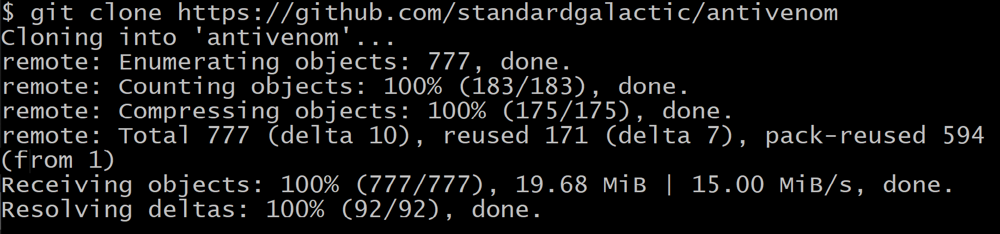
  </a>

<!--
## Machine Learning

Trained a classifier to determine whether a word is easier to type using QWERTY or DVORAK

[Project Page](https://standardgalactic.github.io/keyboard)

## Typeface Experiments:

[Sliders Prototype](https://standardgalactic.github.io/sliders-prototype.html)

[Sliders Prototype v2](https://standardgalactic.github.io/sliders-prototype-v2.html)

[Sliders](https://standardgalactic.github.io/sliders.html)
[Portal](https://standardgalactic.github.io/portal.html)

## Interactive Fiction

[Timeslip](https://standardgalactic.github.io/timeslip)

[Bruno's Ark](https://standardgalactic.github.io/alphabet/brunos-ark.html)

[Bruno's Ark](https://standardgalactic.github.io/brunos-ark.txt)

[Grabby Aliens Attack!](https://github.com/search?q=Owner%3Astandardgalactic+%22Grabby+aliens%22&type=code&p=1) 
-->

## Generative Art

[Daughters of the Air](https://standardgalactic.github.io/alphabet/video-player.html)
<!--
[𝘛𝘦𝘢 𝘥𝘳𝘪𝘯𝘬𝘪𝘯𝘨 𝘪𝘯 𝘔𝘺𝘵𝘪𝘴𝘩𝘤𝘩𝘪, 𝘯𝘦𝘢𝘳 𝘔𝘰𝘴𝘤𝘰𝘸](https://standardgalactic.github.io/capstone)
-->

## <big>Earth Cube Translator</big>

  <a href="https://standardgalactic.github.io/earth-cube.html">
    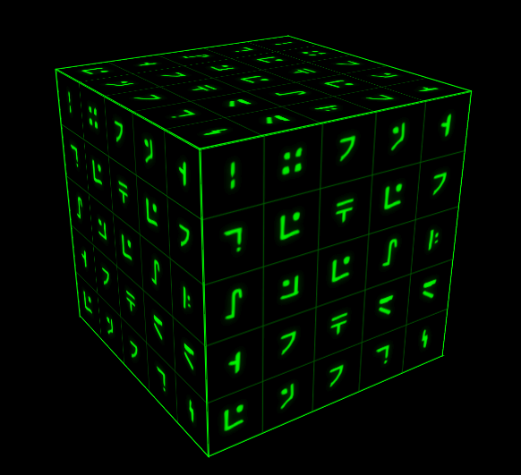
  </a>

<!--
## My Timeline

[Unpublished Facebook Posts](https://standardgalactic.github.io/timeline.html)

-->
## Psychonomics

*[The Limits of Logic](https://github.com/standardgalactic/kitbash/tree/main/research)*

*[Hypoception](https://standardgalactic.github.io/random-thoughts/hypoception-overview.txt)* — Hypothesis-based perception

*[Vectorial Code](https://standardgalactic.github.io/random-thoughts/vectorial-code-overview.txt)*

## <big>Paradigm Shift — ʇɟıɥS ɯɓıpɐɹɐԀ</big> 

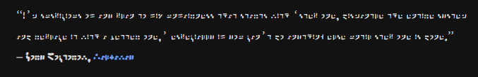

[Ecphoric Overview](https://standardgalactic.github.io/random-thoughts/ecphoric-overview.txt)

Try my new cryptographic fonts, [Clypto, Cheiro,](https://standardgalactic.github.io/ensign) and [Logico-Philosophicus](https://standardgalactic.github.io/alphabet/cipher.html)

Added [Simplectomy Generator](https://standardgalactic.github.io/example)

Broadcast [The Oblicosm Paradox](https://youtube.com/live/0GVvy5s-bXw)

---
Updated main website, [provethatyouarenotarobot.com](https://standardgalactic.github.io/vectorspace/#/galaxy/word2vec-wiki?cx=-3208&cy=-8930&cz=2898&lx=-0.2059&ly=-0.6299&lz=-0.5451&lw=0.5135&ml=300&s=1.75&l=1&v=d50_clean), and added a *[Site Map](http://standardgalactic.github.io/sitemap).*
<!--
[LLM workspace](https://github.com/llm-workflow-engine/llm-workflow-engine) featuring [quadrivium](https://github.com/standardgalactic/quadrivium) and [xylomancy](https://github.com/standardgalactic/xylomancy) (and [ollama](https://github.com/ollama/ollama) with [wizardlm2](https://wizardlm.github.io/WizardLM2/)) now available as a [docker image on Dockerhub](https://hub.docker.com/layers/mechachleopteryx/workflow-engine/quantum_soup/images/sha256-4870f5ae5ebafb974b474ca83f955f6a357fd07a09466de7f3d117868723708b).
-->

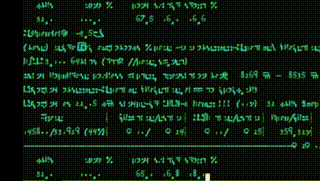

    <a href="https://standardgalactic.github.io/gamma-waves/idea-map.html">
        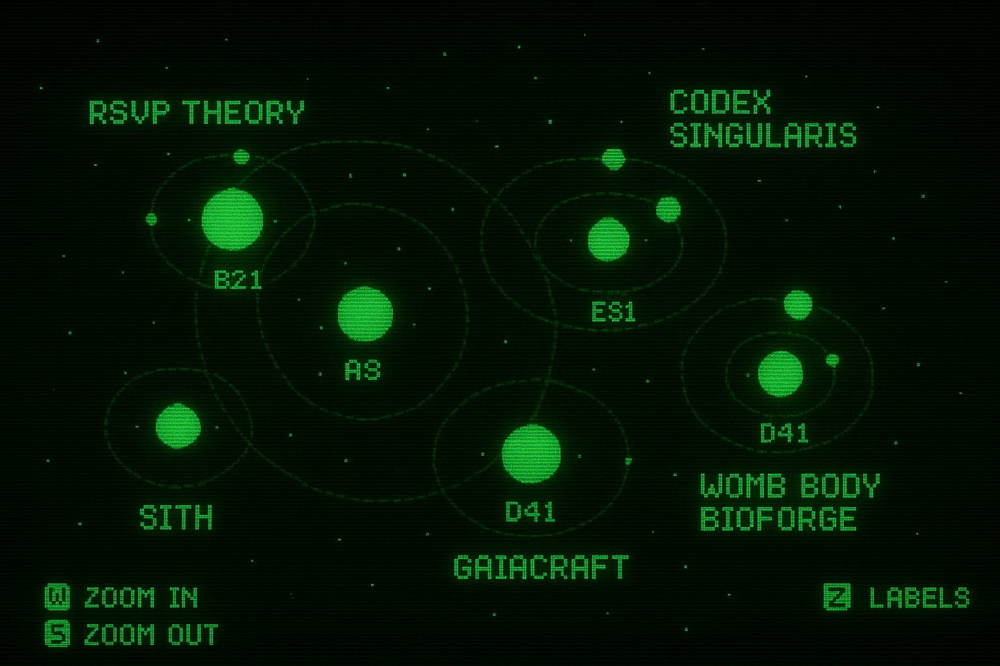
    </a>

   
[Digital Analog Clock](https://standardgalactic.github.io/dactyl-clock.html)

<!-- START_QUOTE -->
<!-- Dual-Wave Encoding -->

**Holistic Understanding**

> Holistic understanding demands that we give the machine everything we have. Filtering or cleaning input data can lead to confusion in real-life scenarios. To enable true understanding, we should avoid heavy-handed heuristic cleanup of the input data.
>
>— 𝘔𝘰𝘯𝘪𝘤𝘢 𝘈𝘯𝘥𝘦𝘳𝘴𝘰𝘯
>
> Read more: [The Red Pill of Machine Learning](https://experimental-epistemology.ai/the-red-pill-of-machine-learning/)

<!-- END_QUOTE -->

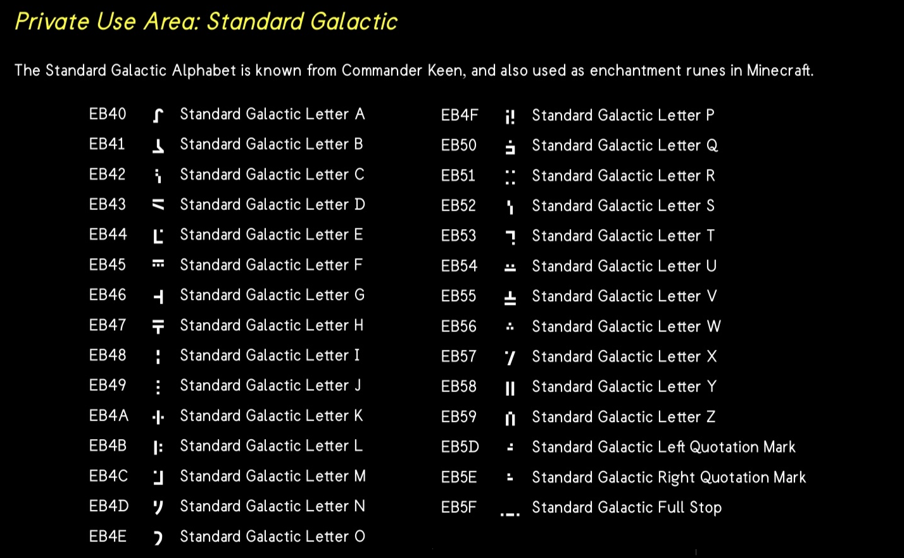

## My AutoHotkey Shortcuts

[PrintScreen](https://raw.githubusercontent.com/standardgalactic/example/refs/heads/main/PrintScreen.ahk)

## **Impossible Physics**

[Magnetic Fluidic Computing](https://standardgalactic.github.io/library/brainstorming-session-detailed.html)

**Geometric Bayesianism with Sparse Heuristics**

In biological systems, sparsity emerges as a natural consequence of physiological pressures, including energetic constraints, signal noise, and chemical gradients, obviating the need for explicit computational penalties to enforce minimal network complexity.

Metabolic costs, such as ATP consumption in neural and cellular activity, favor sparse activation patterns, acting as an implicit prior for minimal energy configurations. Environmental noise and signal overlap amplify high-salience, sparsely distributed signals, while thermodynamic gradients drive systems toward low-entropy states.

This Natural Sparsity Principle underpins the efficiency of biological cognition and informs computational models like Geometric Bayesianism with Sparse Heuristics (GBSH), suggesting that sparse proxy navigation can be an emergent property in biomimetic systems, enhancing their adaptability and resilience in noisy, resource-constrained environments.

[What I'm working on](https://github.com/standardgalactic?tab=repositories&q=&type=source&language=&sort=)

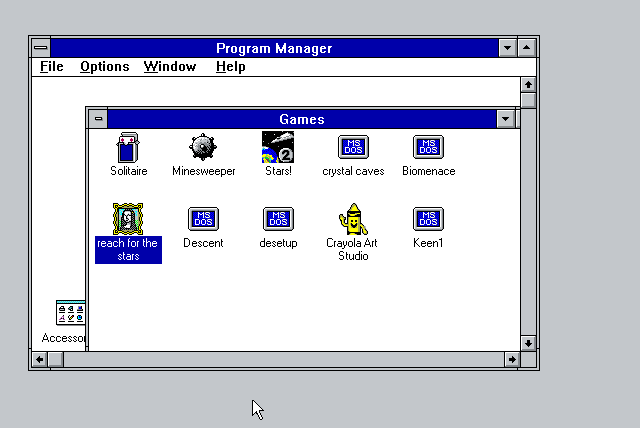

<!--
[Reverse Engineering Swype](https://www.perplexity.ai/search/i-m-looking-for-patents-open-s-c5OCTDU3SDauid2nthyLOQ)
-->
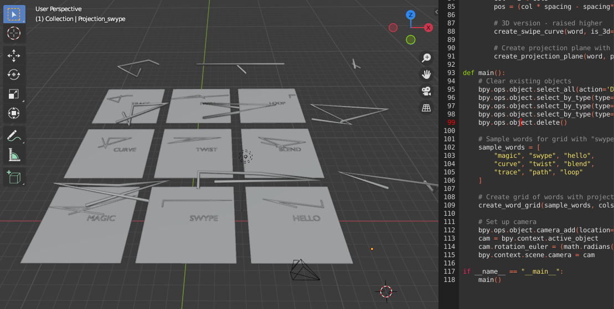

Play [Chrobatos](https://standardgalactic.github.io/chrobatos.html) — a Resistor Color Number Game
<!--
Learn [Assembly Theory](https://standardgalactic.github.io/alphabet/Assembly-Theory.txt) 

[Latin](https://standardgalactic.github.io/flashcards.html) -->

[Small World Generator](http://standardgalactic.github.io/Centerfuge)

<!--
[Liminal Space](https://github.com/standardgalactic/substrate?tab=readme-ov-file)
-->
[Eclectric Oil](https://standardgalactic.github.io/eclectric-oil/)

[Circle of Fifths](https://standardgalactic.github.io/circle-of-fifths/)

[𝘌𝘷𝘰𝘭𝘶𝘵𝘪𝘰𝘯 𝘰𝘧 𝘵𝘩𝘦 𝘗𝘢𝘳𝘢𝘤𝘭𝘦𝘵𝘦](https://standardgalactic.github.io/abraxas)

   
   

C̷̣̝̲̜̈́ͅL͍͚̝͖̭͖̄̍̏O̦̝̬͛̍͗̓͌̊̏T̻͎̬̫̰̭̬̿H̸͎̥̘̘̐ ̜̻͖͎͇͒͑̚ͅ M͍̮̰͈͖̑͜O̟̳ͨ͋͋͐T̫̫ͦ̌̒ͮH͛ͤͣ́Ȇ̩̾ͨ̾ͮȐ̥̤̑ͅ ‏‏

   
   
<!--[𝘉𝘢𝘤𝘬𝘸𝘢𝘳𝘥 𝘊𝘰𝘮𝘱𝘢𝘵𝘪𝘣𝘭𝘪𝘵𝘺](https://standardgalactic.github.io/backward-compatibility)-->

**My Wikipedia**

[Sandbox](https://en.wikipedia.org/wiki/User:Mechachleopteryx/sandbox)

[Contributions](https://en.wikipedia.org/wiki/Special:Contributions/Mechachleopteryx)

I am following 200,000 pages on Wikipedia

<!-- Level 2 Unlocked - Wikipedia watchlist limit removed-->

[My Watchlist](https://github.com/standardgalactic/haplopraxis/blob/primary/Wikipedia-watchlist.txt)

* If you would like to do the same, you can cut-and-paste it [here](https://en.wikipedia.org/wiki/Special:EditWatchlist/raw).

Interactive Mindmap

[Yarnball Earth](https://standardgalactic.github.io/yarnball-earth.html)
 
<!--
[Merch Store](https://www.redbubble.com/en/people/flyxion/shop)
-->

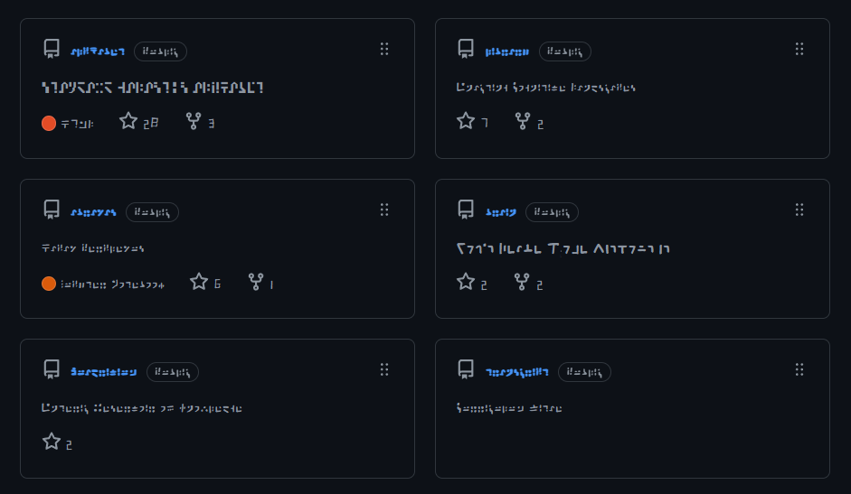
