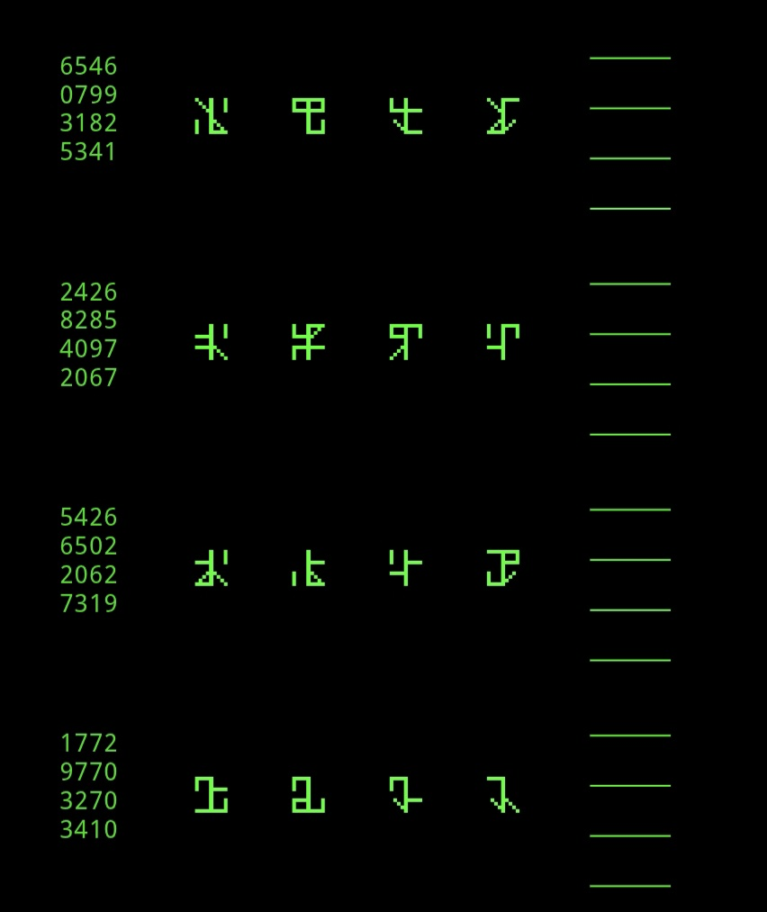
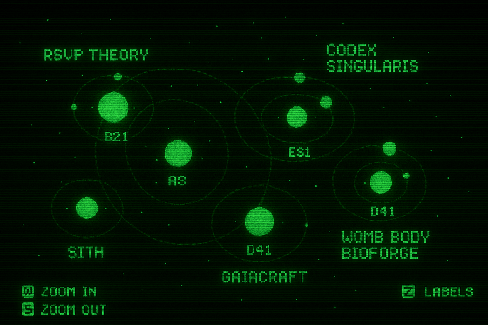

**Home of the [Standard Galactic Alphabet](https://standardgalactic.github.io/alphabet)**
<!-- **Home of the [Standard Galactic Alphabet](https://standardgalactic.github.io/sitemap/fonts/demo.html)** -->

𒋛𒈠 𒃻 𒅗 𒁹

<!--
[Convert this page into Standard Galactic](https://raw.githubusercontent.com/standardgalactic/standardgalactic/refs/heads/main/github-profile.png) *Beta*

[Convert this page into Standard Galactic](https://raw.githubusercontent.com/standardgalactic/standardgalactic/refs/heads/main/year-in-review-2025-chrome.png) *Beta*

[Convert this page into Standard Galactic](https://github.com/standardgalactic/standardgalactic/blob/main/profile-snapshot.png) *Beta*

[Convert this page into Standard Galactic](https://github.com/standardgalactic/standardgalactic/blob/main/github-profile-large-print.png) *Beta*
-->

[Convert this page into Standard Galactic](https://github.com/standardgalactic/standardgalactic/blob/main/banner.png) *Beta*
<!--  -->

Try the [Cistercian Number Translator](https://standardgalactic.github.io/cistercian.html) and [Worksheet Generator](https://standardgalactic.github.io/generate-worksheet.html). For further information, see [wikipedia](https://en.wikipedia.org/wiki/Cistercian_numerals)
 
[Terminal Simulator](https://standardgalactic.github.io/terminal-simulator)

[Galactic Translator](https://standardgalactic.github.io/sga-converter.html)

And [Typing Tutor](https://standardgalactic.github.io/typing-tutor.html)

## Mereological Space Ontology

[Memory Game](https://standardgalactic.github.io/userspace/)

<!--

-->
Introducing [Spherepop](https://standardgalactic.github.io/spherepop/), a 3D Programming Language.

<!-- 
[Music](https://standardgalactic.github.io/spherepop/music/)

-->
Play the *[Spellpop](https://standardgalactic.github.io/spherepop/spellpop.html)* and *[Starpop](https://standardgalactic.github.io/Centerfuge/starpop/)* minigames.

[Logical Symbols](https://standardgalactic.github.io/spherepop/memory-game.html) 

<!--
[Arabic Vocabulary](https://standardgalactic.github.io/spherepop/lexicon-terminal.html) 
-->
[Arabic Vocabulary](https://standardgalactic.github.io/spherepop/lexicon-terminal-v2.html) 

[Etch-a-Sketch Simulator](https://standardgalactic.github.io/spherepop/etch-pipsqueak.html) 

<!--
These small browser programs function as experimental interfaces for thinking about computation, language, and geometry rather than as conventional games. Each tool forms a compact interactive system in which the user progressively constrains a space of possibilities through simple actions, demonstrating how structured outcomes emerge from sequences of small decisions.

The vocabulary trainer illustrates this directly. Each round presents several alternatives, and the learner eliminates incorrect possibilities until the correct translation remains — a constraint-selection process rather than brute enumeration. The program's weighted selection mechanism increases a card's weight after errors and reduces it after correct responses, guiding attention toward weaker vocabulary without complex scheduling. Each entry stores the Arabic form, the English translation, a domain tag, and learning state variables, allowing the same dataset to support topology, category theory, linguistics, or any other thematic domain with minimal structural change. The CRT-style interface, scanlines, and phosphor glow reinforce the sense of a small computational instrument rather than a conventional application.

The Etch-Terminal tool follows the same philosophy applied to geometry. Each movement of the virtual knobs adds another constraint to the final curve. The Pipsqueak language extends this by allowing curves to be described symbolically: a short script expands into a deterministic sequence of drawing steps whose construction history can be replayed at any speed.

The session codes used across both tools encode only the information needed to recreate the interaction. A short string functions as a compressed history of the session.

Taken together, these projects treat the user's actions as part of the algorithm and expose the generative process behind the result — sitting somewhere between educational tools, programming toys, and demonstrations of how complex structures arise from simple rule-based interaction.

[Old Art Archive](https://standardgalactic.github.io/archive)

[Living Paintings](https://standardgalactic.github.io/video-player)

[Follow me on Facebook](https://standardgalactic.github.io/facebook-pages/index.html)

*New* [Ephemera](https://github.com/standardgalactic/ephemera)— *Odds and Ends*

* [Audio Overviews](https://standardgalactic.github.io/research-projects/Aurora/)
-->

[Audio Field Monitor](https://standardgalactic.github.io/guardrails/stack/)

# Parody Music

[Better Than Human](https://standardgalactic.github.io/audio-player.html) 

# Work in Progress

[Reality Is What Can Be Reached](https://standardgalactic.github.io/research-projects/philosophy/reality_reachability.pdf)

* [The Reachability Ontology](https://standardgalactic.github.io/research-projects/philosophy/The_Reachability_Ontology.pdf)

[Astrophysics After the Uniform Object](https://standardgalactic.github.io/research-projects/philosophy/astrophysics_after_uniform_object.pdf)

* [Beyond the Uniform Object](https://standardgalactic.github.io/research-projects/philosophy/Beyond_the_Uniform_Object.pdf)

[Reconstruction and Distinction](https://standardgalactic.github.io/research-projects/philosophy/reconstruction_and_distinction.pdf)

* [The Reconstruction Imperative](https://standardgalactic.github.io/research-projects/philosophy/The_Reconstruction_Imperative-notes.pdf)

[Latent Structure](https://standardgalactic.github.io/research-projects/philosophy) — *Audio Visualizers*

[Frozen Processes](https://standardgalactic.github.io/playfloor/reachability/frozen_processes.pdf)

A process-primary framework arguing that many things we treat as fundamental entities are actually stable residues of trajectories moving through spaces of possibility. The central question is shifted from "What exists?" to "What remains reachable, and under what conditions?"

* [Topographies of Possibility](https://standardgalactic.github.io/playfloor/reachability/Topographies_of_Possibility.pdf)

* [Notes](https://standardgalactic.github.io/playfloor/reachability/Frozen_Processes-notes.pdf)

[Belief Geometry and Reachability](https://standardgalactic.github.io/playfloor/reachability/belief_geometry.pdf)

A synthesis of computational mechanics, predictive inference, and reachability theory, arguing that belief states are coordinates on a manifold of accessible futures and that reasoning is best understood as navigation through that geometry.

* [The Reachability Manifold](https://standardgalactic.github.io/playfloor/reachability/The_Reachability_Manifold.pdf)

* [The Secret Lives of Nouns](https://standardgalactic.github.io/playfloor/reachability/reachability-comic.pdf) — *Graphic Novel*

[Audio Overviews](https://standardgalactic.github.io/playfloor/reachability/)

[Constraint, Reachability, and Relaxation](https://standardgalactic.github.io/calculus/baseline/constraint_reachability_relaxation.pdf)

* [Admissibility as a Unifying Concept](https://standardgalactic.github.io/calculus/baseline/admissibility-essay.pdf)

* [Universal Admisibility Geometry](https://standardgalactic.github.io/calculus/baseline/Universal_Admissibility_Geometry.pdf)

* [Graphic Novel](https://standardgalactic.github.io/calculus/baseline/admissibility-comic.pdf)

[Flow Computing](https://standardgalactic.github.io/calculus/baseline/computing_as_flow.pdf)

* [Computing as Flow](https://standardgalactic.github.io/calculus/baseline/Computing_as_Flow-notes.pdf)

[Civilization’s Undo Stack](https://standardgalactic.github.io/calculus/baseline/markov_boundaries.pdf)

[Preference Fields on Semantic Manifolds](https://standardgalactic.github.io/calculus/baseline/preference_fields.pdf)

* [Geometric Preference Fields](https://standardgalactic.github.io/calculus/baseline/Geometric_Preference_Fields.pdf)

* [The Geometry of Preference](https://standardgalactic.github.io/calculus/baseline/geometry-of-preference-comic.pdf) — *Graphic Novel*

[Persistent Anomalies](https://standardgalactic.github.io/calculus/baseline/persistent_anomalies.pdf)

* [The Geometry of Ontology Revision](https://standardgalactic.github.io/calculus/baseline/Persistent_Anomalies-notes.pdf)

[Possibility Space](https://standardgalactic.github.io/calculus/baseline/) — *Audio Overviews*

[When Systems Change Their Minds](https://standardgalactic.github.io/computation/abstraction/distributed-agency.pdf)
<!--
[The Flyxion Dependency Atlas](https://standardgalactic.github.io/computation/abstraction/flyxion_atlas.pdf)

* [Volume Zero](https://standardgalactic.github.io/computation/abstraction/volume_zero.pdf)
-->

[Audio Overviews](https://standardgalactic.github.io/computation/abstraction/)

[Multiscale Constraint Flow](https://standardgalactic.github.io/alphabet/cosmology/multiscale-constraint-flow.pdf)

* [The Geometry of Possibility](https://standardgalactic.github.io/alphabet/cosmology/The_Geometry_of_Possibility.pdf) — *Notes*

* [Overview](https://standardgalactic.github.io/alphabet/cosmology/multiscale-constraint-overview.pdf) — *Cheatsheet*

[Holonomic Space](https://standardgalactic.github.io/alphabet/cosmology/holonomic-space.pdf)

* [Admissible Projections](https://standardgalactic.github.io/alphabet/cosmology/Admissible_Projections.pdf)

[Three Smoothing Mechanisms](https://standardgalactic.github.io/alphabet/cosmology/three_smoothing_mechanisms.pdf)

* [The New Cosmological Taxonomy](https://standardgalactic.github.io/alphabet/cosmology/The_New_Cosmological_Taxonomy.pdf) — *Notes*

[The Reductive Manifold](https://standardgalactic.github.io/alphabet/cosmology/The_Reductive_Manifold.pdf)

[Audio Overviews](https://standardgalactic.github.io/alphabet/cosmology/)

[Semantic Infrastructure](https://standardgalactic.github.io/playfloor/processing/semantic-infrastructure.pdf)

* [Accessibility Geometry](https://standardgalactic.github.io/playfloor/processing/Accessibility_Geometry.pdf)

* [The Geometry of Accessibility](https://standardgalactic.github.io/playfloor/processing/The_Geometry_of_Accessibility.pdf) — *Notes*

* [Audio Overviews](https://standardgalactic.github.io/playfloor/processing/)

[The Geometry of Closure](https://standardgalactic.github.io/alphabet/processing/geometry_of_closure.pdf)

* [The Logic of Ontological Enlargement](https://standardgalactic.github.io/alphabet/processing/The_Logic_of_Ontological_Enlargement.pdf) — *Notes*

* [Graphic Novel](https://standardgalactic.github.io/alphabet/processing/geometry-of-closure-comic.pdf)

* [Why Mathematical Realities Outgrow Their Maps](https://standardgalactic.github.io/alphabet/processing/audio-visualizer.html) — *Audio Overview*

[Beyond Process](https://standardgalactic.github.io/playfloor/admissibility/beyond_process.pdf)

[Constraint Before Content](https://standardgalactic.github.io/playfloor/admissibility/constraint_before_content.pdf)

[Hidden Curvature](https://standardgalactic.github.io/playfloor/admissibility/admissibility-field.pdf)

* [Notes](https://standardgalactic.github.io/playfloor/admissibility/hidden-curvature.pdf)

* [Law of Invariance](https://standardgalactic.github.io/playfloor/admissibility/law-of-invariance.pdf)

* [Structure Surviving Transformation](https://standardgalactic.github.io/playfloor/admissibility/) — *Audio Overviews*

[Epistemic Reduction](https://standardgalactic.github.io/playfloor/epistemology/epistemic-reduction.pdf)

* [The Geometry of Understanding](https://standardgalactic.github.io/playfloor/epistemology/The_Geometry_of_Understanding.pdf)

[The Projection Crisis](https://standardgalactic.github.io/playfloor/epistemology/projection_crisis.pdf)

* [The Projection Crisis](https://standardgalactic.github.io/playfloor/epistemology/The_Projection_Crisis.pdf)

[Hydra Architecture](https://standardgalactic.github.io/playfloor/epistemology/hydra_architecture.pdf)

* [Geometric Agency](https://standardgalactic.github.io/playfloor/epistemology/Geometric_Agency.pdf)

* [Epistemology Survey Instrument](https://standardgalactic.github.io/playfloor/epistemology/) — *Audio Overviews*

[The Admissibility Protocol](https://github.com/standardgalactic/playfloor/blob/main/processing/working/README.md)

[Compressed Causality](https://standardgalactic.github.io/playfloor/processing/working/CompressedCausality.pdf)

* [Yarn Relational Topology](https://standardgalactic.github.io/playfloor/processing/working/Yarn_Relational_Topology.pdf) — *Notes*

* [Audio Overviews](https://standardgalactic.github.io/playfloor/processing/working/)

[Hidden Manifolds](https://standardgalactic.github.io/alphabet/manuscripts/hidden_manifolds.pdf)

* [Mapping Hidden Manifolds](https://standardgalactic.github.io/alphabet/manuscripts/Mapping_Hidden_Manifolds.pdf) — *Notes*

* [The Hidden Geometry of Global Movement](https://standardgalactic.github.io/alphabet/manuscripts/) — *Audio Overview*

[Accessibility Relaxation and Friedmann Instability](https://standardgalactic.github.io/cosmology/accessibility-relaxation.pdf)

* [The RSVP Revolution](https://standardgalactic.github.io/cosmology/The_RSVP_Revolution.pdf)

* [The RSVP Blueprint](https://standardgalactic.github.io/cosmology/The_RSVP_Blueprint.pdf)

* [Audio Overviews](https://standardgalactic.github.io/cosmology/)

[Constraint as Ground](https://standardgalactic.github.io/memnet/sparse-representations/constraint_as_ground.pdf)

* [Topological Intelligence](https://standardgalactic.github.io/memnet/sparse-representations/Topological_Intelligence.pdf)

* [Notes](https://standardgalactic.github.io/memnet/sparse-representations/Constraint_as_Ground-notes.pdf)

* [The Engine of Intelligence](https://standardgalactic.github.io/memnet/sparse-representations/) — *Audio Overview*

[Morphology as Computation](https://standardgalactic.github.io/research-projects/epistemology/morphology-as-computation.pdf)

* [Why Physical Boundaries Define Intelligence](https://standardgalactic.github.io/research-projects/epistemology/) — *Audio Overview*
<!--
[Observable Classicalization](https://standardgalactic.github.io/alphabet/working/observable-classicalization.pdf)
-->

[Beyond Prediction Error](https://standardgalactic.github.io/alphabet/framework/beyond_prediction_error.pdf)

* [Topological Persistence](https://standardgalactic.github.io/alphabet/framework/Topological_Persistence.pdf) — *Notes*

* [Why Brains Navigate Instead of Predict](https://standardgalactic.github.io/alphabet/framework/audioscope.html) — *Audio Overview*

[Everything is a Clipboard](https://standardgalactic.github.io/alphabet/framework/everything_is_a_clipboard.pdf)

* [The Navigable Manifold](https://standardgalactic.github.io/alphabet/framework/The_Navigable_Manifold.pdf)

* [Everything you Think is a Clipboard](https://standardgalactic.github.io/alphabet/framework/) — *Audio Overview*

[Propagating Constraint Fields](https://standardgalactic.github.io/alphabet/working/constraint-propagation.pdf)

* [The Organizational Manifold](https://standardgalactic.github.io/alphabet/working/The_Organizational_Manifold.pdf) — *Notes*

* [Audio Overviews](https://standardgalactic.github.io/alphabet/working/)

* [Music](https://standardgalactic.github.io/alphabet/working/music.html)

[Hydra — Hybrid Dynamic Reasoning Architecture](https://standardgalactic.github.io/memnet/operator-logic/hydra.pdf)

* [Architecture of Constraint](https://standardgalactic.github.io/memnet/operator-logic/Architecture_of_Constraint.pdf) — *Notes*

* [Semantic Physics](https://standardgalactic.github.io/memnet/operator-logic/Semantic_Physics.pdf) — *Notes*

[Function Survives Collapse](https://standardgalactic.github.io/alphabet/working/function_survives_collapse.pdf)

[Constraint Geometry Audioscope](https://standardgalactic.github.io/memnet/operator-logic/) — *Audio Overviews*

* Dynamic Programming from Physics to Consciousness
* Your Body Plays Every Song You Hear
* Intelligence is the Geometry of Constraints

[The Unreadability of Dynamic Readability](https://standardgalactic.github.io/kitbash/processing/unreadability.pdf)

* [Navigable Architecture](https://standardgalactic.github.io/kitbash/processing/Navigable_Architecture.pdf) — *Notes*

* [Why Unreadable Writing is Engineered to Fail](https://standardgalactic.github.io/kitbash/processing/obscurantism.html)

[When Noise Becomes Structure](https://standardgalactic.github.io/alphabet/research/noise-becomes-structure.pdf)

* [Beyond the Bounded Organism](https://standardgalactic.github.io/alphabet/research/Beyond_the_Bounded_Organism.pdf) — *Notes*

* [How Math Blinded Us to the Microbiome](https://standardgalactic.github.io/alphabet/research/microbiome.html) — *Audio Overview*

[Repair as a Fundamental Category](https://standardgalactic.github.io/alphabet/research/repair_as_fundamental.pdf)

[Semantic Stability as a Repair Equilibrium](https://standardgalactic.github.io/alphabet/research/semantic_stability.pdf)

[Language as Constraint Field](https://standardgalactic.github.io/alphabet/research/language_as_constraint_field.pdf)

[The Historical Screenplay as Spherepop Program](https://standardgalactic.github.io/alphabet/research/screenplay_as_program.pdf)

[The Xylomorphic Premise](https://standardgalactic.github.io/antivenom/futurology/xylomorphic-premise.pdf)

* [Notes](https://standardgalactic.github.io/antivenom/futurology/Xylomorphic_Infrastructure.pdf)

# The Admissibility Program

[Flyxion Project Map](https://standardgalactic.github.io/playfloor/coordinates/flyxion_project_map-core.pdf)

[Admissibility All the Way Down](https://standardgalactic.github.io/playfloor/coordinates/functional_programming_admissibility.pdf)

* [Notes](https://standardgalactic.github.io/playfloor/coordinates/The_Admissibility_Program.pdf)

* [Core Notes](https://standardgalactic.github.io/playfloor/coordinates/The_Admissibility_Program%20-%20core.pdf)

[Separation of Measure](https://standardgalactic.github.io/playfloor/coordinates/separation-of-measure.pdf)

* [Infinite Kernel Separation](https://standardgalactic.github.io/playfloor/coordinates/Infinite_Kernel_Separation.pdf)

[Waves of Collapse](https://standardgalactic.github.io/playfloor/coordinates/waves-of-collapse.pdf)

* [Notes](https://standardgalactic.github.io/playfloor/coordinates/Waves_of_Collapse.pdf)

[Audio Overviews](https://standardgalactic.github.io/playfloor/coordinates/)

[The Eight-Letter Keyboard](https://standardgalactic.github.io/research-projects/admissibility-lab/eight_letter_keyboard.pdf)

* [The Eight-Letter Motor Phonology](https://standardgalactic.github.io/research-projects/admissibility-lab/The_Eight_Letter_Motor_Phonology.pdf)

[Motor Phonology and Symbolic Reachability](https://standardgalactic.github.io/research-projects/admissibility-lab/motor_phonology.pdf)

* [The Motor Manifold](https://standardgalactic.github.io/research-projects/admissibility-lab/The_Motor_Manifold.pdf)

* [The Reconstruction Imperative](https://standardgalactic.github.io/research-projects/admissibility-lab/The_Reconstruction_Imperative-extended.pdf)

[Continuations Before Objects](https://standardgalactic.github.io/research-projects/admissibility-lab/continuations_before_objects.pdf)

* [Reachability Geometry](https://standardgalactic.github.io/research-projects/admissibility-lab/Reachability_Geometry.pdf)

[Audio Overviews](https://standardgalactic.github.io/research-projects/admissibility-lab/)

# Distinguishability Geometry

[Activation Manifolds as Admissibility Fields](https://standardgalactic.github.io/playfloor/working/admissibility_fields.pdf)

* [The Topography of Possiblity](https://standardgalactic.github.io/playfloor/working/The_Topography_of_Possibility.pdf)

* [The Cloak](https://standardgalactic.github.io/playfloor/working/the-cloak.pdf) — *Graphic Novel*

* [The Geometry of Escape](https://standardgalactic.github.io/playfloor/working/The_Geometry_of_Escape.pdf) — *Notes*

[Beyond Prediction](https://standardgalactic.github.io/playfloor/working/beyond_prediction.pdf)

* [The Geometry of Reachability](https://standardgalactic.github.io/playfloor/working/The_Geometry_of_Reachability.pdf)

[Programs as Histories](https://standardgalactic.github.io/playfloor/working/programs-as-histories.pdf)

* [The Spherepop Inversion](https://standardgalactic.github.io/playfloor/working/The_Spherepop_Inversion.pdf)

[Distinguishability Geometry](https://standardgalactic.github.io/playfloor/working/distinguishability_geometry.pdf)

* [Notes](https://standardgalactic.github.io/playfloor/working/The_Geometry_of_Distinguishability.pdf)

[Distinction Before Objects](https://standardgalactic.github.io/playfloor/working/distinction_before_objects.pdf)

[Audio Overviews](https://standardgalactic.github.io/playfloor/working/)

# Alignment Research

[The Paradox of Precaution](https://standardgalactic.github.io/kitbash/paradox-of-precaution.pdf)

[Broken Tools for a Breaking World](https://standardgalactic.github.io/antivenom/framework/fragility-metacrisis.pdf)

* [Notes](https://standardgalactic.github.io/antivenom/framework/Broken_Tools_for_a_Breaking_World.pdf)

* [How AI Fragility Fuels the Metacrisis](https://standardgalactic.github.io/antivenom/framework/) — *Audio Overview*

[Globally Persistent Recomposable Thought](https://standardgalactic.github.io/spherepop/intelligence-explosion.pdf)

* [Github Is the Real Intelligence Explosion](https://standardgalactic.github.io/spherepop/processing/) — *Audio Overview*

[The Meritocracy That Wasn't](https://standardgalactic.github.io/antivenom/sociology/remote_work.pdf)

* [Why Your Remote Job Applications Disappear](https://standardgalactic.github.io/antivenom/sociology/) — *Audio Overview*

[Proxy Permanence Failure](https://standardgalactic.github.io/antivenom/persistence/proxy_permanence_failure.pdf)

* [Beyond the Carbon Ledger](https://standardgalactic.github.io/antivenom/persistence/Beyond_the_Carbon_Ledger.pdf)

* [Notes](https://standardgalactic.github.io/antivenom/persistence/proxy_permanence_failure-notes.pdf)

* [Audio Overviews](https://standardgalactic.github.io/antivenom/persistence/)

[The Quiet Battlefield](https://standardgalactic.github.io/antivenom/quiet_battlefield.pdf)

* [Algorithmic Harm](https://standardgalactic.github.io/antivenom/opinion/algorithmic-harm.html) — *Audio Overview*

[Return Under Constraint](https://standardgalactic.github.io/workspace/return_under_constraint.pdf) — *Meditations on the Talbiya*

* [Audio Overview](https://standardgalactic.github.io/workspace/processing/)

[Abundance Without Distribution](https://standardgalactic.github.io/userspace/labor_singularity.pdf) — *Labor Singularity*

* [Audio Overview](https://standardgalactic.github.io/userspace/futurism/)

<!--
[The Moon Should Not Be a Computer](https://standardgalactic.github.io/computation/moon-not-computer.pdf)

[Xylomorphic Computation](https://standardgalactic.github.io/computation/xylomorphic_computation.pdf)

* [Why AI Servers Fail in Space](https://standardgalactic.github.io/computation/?moon) – *Audio Overview*

* [Why Data Centers Must Mimic Trees](https://standardgalactic.github.io/computation/?trees) – *Audio Overview*
-->
[The Monetization of Redundancy](https://standardgalactic.github.io/antivenom/Monetization-of-Redundancy.pdf)

* [Audio Overview](https://standardgalactic.github.io/antivenom/processing/)

[Thermodynamic Reachability](https://standardgalactic.github.io/library/Thermodynamic-Reachability.pdf)

[The Collapse of Proxy Integrity](https://standardgalactic.github.io/antivenom/proxy_integrity.pdf)

[Against Indiscriminate Visibility](https://standardgalactic.github.io/alphabet/Against%20Indiscriminate%20Visibility.pdf)

* [Audio Overview](https://standardgalactic.github.io/alphabet/visibility/)

[The Coordinate-System Error](https://standardgalactic.github.io/alphabet/attention-essay.pdf)

[The Hollow Network](https://standardgalactic.github.io/antivenom/resources/synthetic_sociality_v3-2.pdf) 

[The Expiatory Gap](https://standardgalactic.github.io/alignment/The%20Expiatory%20Gap.pdf)

[Convergence Before Autonomy](https://standardgalactic.github.io/alignment/Convergence%20Before%20Autonomy.pdf)

* [Audio Overview](https://standardgalactic.github.io/alignment/working/)

[The Ecology of Neoteny](https://standardgalactic.github.io/alphabet/The%20Ecology%20of%20Neoteny.pdf)

[Spectacle Runtime](https://standardgalactic.github.io/alphabet/Spectacle%20Runtime.pdf)

[Distributed Centrality](https://standardgalactic.github.io/library/Distributed%20Centrality.pdf)

* [Audio Overview](https://standardgalactic.github.io/library/projects/?track=gravity)

[The Polemic Debt](https://standardgalactic.github.io/antivenom/The%20Polemic%20Debt.pdf)

* [Audio Overview](https://standardgalactic.github.io/antivenom/working/)
<!--
[Optimization without Restraint](https://standardgalactic.github.io/antivenom/Optimization%20without%20Restraint.pdf)
-->

[The Stack Capture Race](https://standardgalactic.github.io/library/The%20Stack%20Capture%20Race.pdf)
<!--
[Personal Superintelligence](https://standardgalactic.github.io/research-projects/Personal%20Superintelligence.pdf)
-->

[Collective Intelligence Under Constraint](https://standardgalactic.github.io/research-projects/Collective%20Intelligence%20Under%20Constraint.pdf)

<!--
[Ephemeral Feeds](https://standardgalactic.github.io/kitbash/Ephemeral%20Feeds.pdf)
-->
[Scope Memeplexes](https://standardgalactic.github.io/standardgalactic/Scope%20Memeplexes.pdf)

<!--
[Dynamics of the Capital Order](https://standardgalactic.github.io/research-projects/working/capital_order_rsvp.pdf)

* [Audio Overview](https://standardgalactic.github.io/research-projects/working/)

[The Commodification of Categories](https://standardgalactic.github.io/antivenom/The%20Commodification%20of%20Categories.pdf)

[The Age of Artificial Coordination](https://standardgalactic.github.io/antivenom/Artificial%20Coordination.pdf)

[The Hostile Interface](https://standardgalactic.github.io/antivenom/The%20Hostile%20Interface.pdf)

[Dark Patterns](https://standardgalactic.github.io/antivenom/Dark%20Patterns.pdf)

[Monetizing Uncertainty](https://standardgalactic.github.io/antivenom/Monetizing%20Uncertainty.pdf)
-->
[Against Namespace Laundering](https://standardgalactic.github.io/antivenom/Against%20Namespace%20Laundering.pdf)

[Culture and Structural Power](https://standardgalactic.github.io/antivenom/Culture%20and%20Structural%20Power.pdf)

<!--
[When Engagement Stops Pointing](https://standardgalactic.github.io/antivenom/When%20Engagement%20Stops%20Pointing.pdf)

[Aspirational Exhaust](https://standardgalactic.github.io/antivenom/Aspirational%20Exhaust.pdf)

[Induced Homogeneity](https://standardgalactic.github.io/antivenom/Induced%20Homogeneity.pdf)

[Gallery Before Feed](https://standardgalactic.github.io/research-projects/Gallery%20Before%20Feed.pdf)

[Identity Collapse and the Platforming of Fraud](https://standardgalactic.github.io/Identity%20Collapse.pdf)

[The Assumption of Surplus](https://standardgalactic.github.io/antivenom/The%20Assumption%20of%20Surplus.pdf)
-->

[Throwing the Game](https://standardgalactic.github.io/spherepop/Throwing%20the%20Game.pdf)

[Against the Extinction Thesis](https://standardgalactic.github.io/antivenom/Against%20the%20Extinction%20Thesis.pdf)

[Divided We Stand](https://standardgalactic.github.io/antivenom/Divided%20We%20Stand.pdf)
<!--
[Beyond Utility](https://standardgalactic.github.io/research-projects/Beyond%20Utility.pdf)

[Aesthetic Saturation and the Erosion of Voluntary Attention](https://standardgalactic.github.io/antivenom/Aesthetic%20Saturation.pdf)

* [Why Social Media Is Ugly on Purpose](https://standardgalactic.github.io/antivenom/opinion/) – *Audio Overview*

[The Categorical Structure of Alignment](https://standardgalactic.github.io/research-projects/Categorical%20Structure%20of%20Alignment.pdf)

* [Audio Overview](https://standardgalactic.github.io/research-projects/alignment/)
-->

[The Genius of Silence](https://standardgalactic.github.io/alphabet/The%20Genius%20of%20Silence.pdf) — *Draft*

[The Managed Self](https://standardgalactic.github.io/antivenom/The%20Managed%20Self.pdf) — *Draft*

* [Audio Overview](https://standardgalactic.github.io/antivenom/philosophy/)

# Yarncrawler

[Irreversibility and the Ontology of Mind](https://standardgalactic.github.io/yarncrawler/irreversibility_ontology_mind.pdf) 

* [Audio Overview](https://standardgalactic.github.io/yarncrawler/)

[Constraint Before Completion](https://standardgalactic.github.io/yarncrawler/Constraint%20Before%20Completion.pdf)

* [Audio Overview](https://standardgalactic.github.io/yarncrawler/working/)

[World-State Reconstruction](https://standardgalactic.github.io/yarncrawler/World-State%20Reconstruction.pdf)

* [Audio Overview](https://standardgalactic.github.io/yarncrawler/introduction/)

<!--
[Yarncrawler in Action](https://standardgalactic.github.io/yarncrawler/Yarncrawler%20in%20Action.pdf)

# Polyxan and Plenumhub

[Manufacturing Stability](https://standardgalactic.github.io/library/Manufacturing%20Stability.pdf)

* [Audio Overview](https://standardgalactic.github.io/library/projects/?track=geometry)

[The Narrow Path Between Domination and Chaos](https://standardgalactic.github.io/research-projects/The%20Narrow%20Path.pdf)

[Coherence Before Engagement](https://standardgalactic.github.io/alphabet/Coherence%20Before%20Engagement.pdf)

[Semantic Hyperstructures](https://standardgalactic.github.io/research-projects/Polyxan%20Semantic%20Hyperinfrastructure.pdf)

[Verification and Proof Manual](https://standardgalactic.github.io/research-projects/Polyxan%20Proof%20Specification.pdf)

[Starspace Specification](https://standardgalactic.github.io/research-projects/Polyxan%20Starspace%20Specification.pdf) 
-->
# Epistemology

[Geometry, Cognition, and the Transparency of Computation](https://standardgalactic.github.io/spherepop/admissibility/spherepop-monograph.pdf)

* [The Geometry of Computation](https://standardgalactic.github.io/spherepop/admissibility/The_Geometry_of_Computation.pdf) — *Notes*

* [How Nested Bubbles Fix Flat Math](https://standardgalactic.github.io/spherepop/admissibility/) — *Audio Overview*

[The Dynamics of Learning](https://standardgalactic.github.io/alphabet/research/dynamics-of-learning.pdf)

[Beyond Simplicity](https://standardgalactic.github.io/alphabet/research/Beyond_Simplicity.pdf)

* [Audio Overviews](https://standardgalactic.github.io/alphabet/research/)

[Markedness and Capability](https://standardgalactic.github.io/standardgalactic/epistemology/markedness_capability.pdf)

[Manufacturing Credulity](https://standardgalactic.github.io/standardgalactic/epistemology/manufacturing_credulity.pdf)

[Selection Without Design](https://standardgalactic.github.io/standardgalactic/epistemology/selection_without_design.pdf)

* [Aurora Monitor](https://standardgalactic.github.io/standardgalactic/epistemology/) — *Audio Overviews*

[The Collapse of Epistemic Coherence](https://standardgalactic.github.io/alphabet/epistemology/collapse-of-epistemic-coherence.pdf)

* [Synthetic Rigor](https://standardgalactic.github.io/alphabet/epistemology/Synthetic_Rigor.pdf) — *Notes*

* [Why AI Text Feels Deceptively Profound](https://standardgalactic.github.io/alphabet/epistemology/) — *Audio Overview*

# Mechanistic Frameworks

[From Synchrony to Structure](https://standardgalactic.github.io/playfloor/epistemology/from_synchrony_to_structure.pdf)

[How to Build a Neocortex](https://standardgalactic.github.io/workspace/biology/how_to_build_a_neocortex.pdf)

* [Constraint Geometry](https://standardgalactic.github.io/workspace/biology/Constraint_Geometry-notes.pdf) — *Notes*

* [Building the Neocortex Without a Blueprint](https://standardgalactic.github.io/workspace/biology/) — *Audio Overview*

[Never Predict Noise](https://standardgalactic.github.io/alphabet/Never-Predict-Noise.pdf)

* [Why True Intelligence Refuses Noise](https://standardgalactic.github.io/alphabet/physics/working/) — *Audio Overview*

[Constraint-First Gauge Gravity](https://standardgalactic.github.io/alphabet/physics/gauge-gravity.pdf)

* [The Universe is a Self-Correcting Computation](https://standardgalactic.github.io/alphabet/physics/) — *Audio Overview*

[Closure of Closures](https://standardgalactic.github.io/alphabet/biology/closure_of_closures.pdf)

* [Life as a Topological Loop](https://standardgalactic.github.io/alphabet/biology/) — *Audio Overview*

[Amplitwist Cascades](https://standardgalactic.github.io/guardrails/processing/amplitwist_paper.pdf)

* [Lava Thought Visualizer](https://standardgalactic.github.io/guardrails/processing/) 

[Polyxan Semantic Hyperstructure](https://standardgalactic.github.io/research-projects/Polyxan%20Semantic%20Hyperstructure.pdf)

* [The Physics of Persistent AI Worlds](https://standardgalactic.github.io/research-projects/) — *Audio Overview*

[Mesoscale Matter as Constrained Field Dynamics](https://standardgalactic.github.io/calculus/mesoscale_matter.pdf)

[Semantic Relaxation Networks](https://standardgalactic.github.io/research-projects/intelligence/semantic-relaxation-networks.pdf)

* [Why Next Token Prediction Is Not Intelligence](https://standardgalactic.github.io/research-projects/intelligence/) — *Audio Overviews*

[Kernel Operators, Memory, and Field-Theoretic Dynamics](https://standardgalactic.github.io/calculus/kernel-memory.pdf)

* [Universal Memory Monitor](https://standardgalactic.github.io/calculus/)
<!--
[From Field Dynamics to Extractive Systems](https://standardgalactic.github.io/standardgalactic/field_dynamics.pdf)

* [The Physics of Toxic Digital Platforms](https://standardgalactic.github.io/standardgalactic/research/) — *Audio Overview*
-->

[On the Formation of Structural Ideas](https://standardgalactic.github.io/standardgalactic/research/structural_ideas.pdf)

* [Why Great Ideas Are Mathematically Inevitable](https://standardgalactic.github.io/standardgalactic/research/notes/) — *Audio Overview*

[Participation without Guarantee](https://standardgalactic.github.io/antivenom/economics/participation_without_guarantee.pdf)

[The Extraction Attractor](https://standardgalactic.github.io/antivenom/economics/structural_convergence.pdf)

* [Audio Overview](https://standardgalactic.github.io/antivenom/economics/)

[The Entropy of Austerity](https://standardgalactic.github.io/spherepop/entropy_of_austerity.pdf)

* [Audio Overview](https://standardgalactic.github.io/spherepop/dynamics/)

[Trajectory Aware Recursive Tiling with Annotated Noise](https://standardgalactic.github.io/TARTAN/tartan.pdf)

* [Concrete Cracks Analysis](https://standardgalactic.github.io/TARTAN/music/concrete_cracks_analysis.pdf)

* [The Mathematics of Pouring New Foundations](https://standardgalactic.github.io/TARTAN/music/analysis/) — *Audio Overview*

* [Baile Excesivo](https://standardgalactic.github.io/TARTAN/music/) — *Music*

* [Fixing AI Hallucinations](https://standardgalactic.github.io/TARTAN/)  – *Audio Overview*

[From Persuasion to Realization](https://standardgalactic.github.io/TARTAN/persuasion.pdf)

[Compression After Expansion](https://standardgalactic.github.io/alphabet/screenplay/compression_after_expansion.pdf)

<!--
[Inference as Constraint Closure](https://standardgalactic.github.io/kitbash/thesis/constraint_closure.pdf)

* [Audio Overview](https://standardgalactic.github.io/kitbash/thesis/)

* [Why AI Code and Essays Fail](https://standardgalactic.github.io/library/research/) – *Audio Overview*
-->
[The Compiled Self](https://standardgalactic.github.io/blastoids/manuscripts/processing/essay_v8.pdf) 

[Text as Substrate](https://standardgalactic.github.io/library/Text%20as%20Substrate.pdf) 

<!--
[Energy as Contradiction](https://standardgalactic.github.io/library/energy_as_contradiction.pdf) — *Incomplete*

[Geometry from Entropy Flow](https://standardgalactic.github.io/calculus/rsvp_v4.pdf)

[Trajectories All the Way Down](https://standardgalactic.github.io/library/trajectories.pdf)

Geodesics of Attention

* [Standard Galactic](https://standardgalactic.github.io/alphabet/geodesics_of_attention_v3_sga.pdf)
* [Cursive Galactic](https://standardgalactic.github.io/alphabet/geodesics_of_attention_v3_cursive.pdf)
* [Nova Mono](https://standardgalactic.github.io/alphabet/geodesics_of_attention_v3_nova.pdf)

[Synthetic Grounding](https://standardgalactic.github.io/arcanum/synthetic-grounding.pdf)

[Realization Maps](https://standardgalactic.github.io/arcanum/realization-map.pdf)

[Plenum Amplitudes](https://standardgalactic.github.io/arcanum/Plenum%20Amplitudes.pdf)

[The Coordination Engine](https://standardgalactic.github.io/library/The%20Coordination%20Engine.pdf)

[Distributed Minds and Generative Substrates](https://standardgalactic.github.io/research-projects/working/distributed_cognition.pdf)
-->

[Hallucination is Normal](https://standardgalactic.github.io/library/Hallucination%20is%20Normal.pdf)

* [Audio Overview](https://standardgalactic.github.io/library/projects/?track=hallucination)

<!--
[Homotopy and Identity](https://standardgalactic.github.io/research-projects/Homotopy%20and%20Identity.pdf)

[Transformation Before Representation](https://standardgalactic.github.io/kitbash/Transformation%20Before%20Representation.pdf)
-->

[The Mortality of Computation](https://standardgalactic.github.io/alphabet/The%20Mortality%20of%20Computation.pdf)

[Irreversibility as Architecture](https://standardgalactic.github.io/research-projects/Irreversibility%20as%20Architecture.pdf)

[Noun-Free Cognition](https://standardgalactic.github.io/research-projects/Noun-Free%20Cognition.pdf)

An exploration of difficulty, abstraction, and intelligence that treats cognition as the continual renegotiation of what remains unresolved, arguing that difficulty is not an intrinsic property of tasks but a relation between agents, tools, prompts, and environments.

<!--
[Local Tractability and Global Dysfunction](https://standardgalactic.github.io/research-projects/Local%20Tractability%20and%20Global%20Dysfunction.pdf)

[Simulation as Civic Infrastructure](https://standardgalactic.github.io/library/Simulation%20as%20Civic%20Infrastructure.pdf)
-->
[From Minerals to Minds](https://standardgalactic.github.io/alphabet/From%20Minerals%20to%20Minds.pdf)

[The Geometry of Rewiring](https://standardgalactic.github.io/alphabet/ecology/geometry_of_rewiring.pdf) — *Evolutionary Ecology*

* [Why Efficiency Is a Survival Trap](https://standardgalactic.github.io/alphabet/ecology/) — *Audio Overviews*

[Exaptation Under Delayed Evaluation](https://standardgalactic.github.io/alphabet/Exaptation%20Under%20Delayed%20Evaluation.pdf)

<!--
[Abstraction as Reduction](https://standardgalactic.github.io/alphabet/Abstraction%20as%20Reduction.pdf)
-->
[Abstraction as Reduction](https://standardgalactic.github.io/computation/abstraction/Abstraction_as_Reduction.pdf)

* [Graphic Novel](https://standardgalactic.github.io/computation/abstraction/abstraction-comic.pdf)

* [Abstraction is Just Energy Minimization](https://standardgalactic.github.io/alphabet/processing/) — *START HERE*

<!--
[Order and Obfuscation](https://standardgalactic.github.io/research-projects/Order%20and%20Obfuscation.pdf)

[Complexity without Intelligence](https://standardgalactic.github.io/library/Complexity%20without%20Intelligence.pdf)

[Ecphoric Synthesis](https://standardgalactic.github.io/kitbash/Ecphoric%20Synthesis.pdf)

[The Forkability of Time](https://standardgalactic.github.io/spherepop/The%20Forkability%20of%20Time.pdf)

* [Audio Overview](https://standardgalactic.github.io/spherepop/analysis/)

[Active Geodesic Inference](https://standardgalactic.github.io/spherepop/Active%20Geodesic%20Inference.pdf)

[SITH Theory](https://standardgalactic.github.io/alphabet/SITH%20Theory.pdf)
-->

[Worldline Selection Under Constraint](https://standardgalactic.github.io/library/Worldline%20Selection%20Under%20Constraint.pdf)  

[Worldhood without Functionalism](https://standardgalactic.github.io/quantum-soup/Worldhood%20without%20Functionalism.pdf) 

<!--
[Operational Mereology via Event-Sourced Semantics](https://standardgalactic.github.io/spherepop/Operational%20Mereology.pdf)

[The Ontology of Self-Organizing Forms](https://standardgalactic.github.io/arabic-flashcards/monograph.pdf) — *Nearly Complete*

[Manifold-Aligned Generative Inference (MAGI)](https://standardgalactic.github.io/alphabet/MAGI%20-%20draft%2002.pdf) 

[MAGI overview](https://github.com/standardgalactic/research-projects/tree/main/working) 

[Autogenerative Dynamics](https://standardgalactic.github.io/autogenerative-dynamics/)

[The Ergonomics of Prediction](https://standardgalactic.github.io/research-projects/The%20Ergonomics%20of%20Prediction.pdf)

[Axioms for a Falling Universe](https://standardgalactic.github.io/alphabet/Axioms%20for%20a%20Falling%20Universe.pdf)

[The Fall of Space](https://flyxion.github.io/flyxion/rsvp/The%20Fall%20of%20Space.pdf)

[Cosmological Observables Without Expansion](https://standardgalactic.github.io/kitbash/cosmology/rsvp_cosmology_v2.pdf)  — *Working Draft*
-->

[Axioms for a Falling Universe](https://standardgalactic.github.io/alphabet/projects/axioms-for-a-falling-universe.pdf)

* [The RSVP Plenum](https://standardgalactic.github.io/alphabet/projects/The_RSVP_Plenum.pdf) — *Notes*

* [Audio Overview](https://standardgalactic.github.io/alphabet/projects/)

[Fossil Manifolds and Mediated Extraction](https://standardgalactic.github.io/workspace/cosmology/fossil_manifolds.pdf)

* [The Inverse Accessibility Paradox](https://standardgalactic.github.io/workspace/cosmology/The_Inverse_Accessibility_Paradox.pdf) — *Notes*

* [Fossil Manifolds](https://standardgalactic.github.io/workspace/cosmology/Fossil_Manifolds-notes.pdf) — *Notes*

* [The Uncorrupted Cosmic Fossil](https://standardgalactic.github.io/workspace/cosmology/) — *Audio Overview*

<!--
[Everlasting Redshift](https://standardgalactic.github.io/kitbash/Everlasting%20Redshift.pdf)
-->
[Scalar Irruption via Entropic Differential](https://standardgalactic.github.io/workspace/Scalar%20Irruption%20via%20Entropic%20Differential.pdf)

[Physics After Spacetime](https://standardgalactic.github.io/research-projects/Physics%20After%20Spacetime.pdf)
<!--
[Persistence Before Efficiency](https://standardgalactic.github.io/research-projects/Persistence%20Before%20Efficiency.pdf)
-->

[Bootstrapping Utopia](https://standardgalactic.github.io/alphabet/Bootstrapping%20Utopia.pdf) — *Draft*

# MEMNET

[The Admissibility Principle](https://standardgalactic.github.io/memnet/framework/admissibility_principle.pdf)

* [The Universe as Admissibility Constrained Collapse](https://standardgalactic.github.io/memnet/framework/) — *Audio Overview*

[The Semantic State](https://standardgalactic.github.io/memnet/semantic_state.pdf)

* [Audio Overview](https://standardgalactic.github.io/memnet/)

[Process-Relational Architecture](https://github.com/standardgalactic/memnet/tree/main/working/README.md)

* [Process, Projection, and Propagative Reality](https://standardgalactic.github.io/memnet/working/propagative_reality.pdf)

* [From Classifier to Inverse Engine](https://standardgalactic.github.io/memnet/working/gesture_review.pdf)

* [Silicon Cartography](https://standardgalactic.github.io/memnet/working/silicon_cartography.pdf)

* [When the Formalism Becomes the Interface](https://standardgalactic.github.io/memnet/working/formalism-interface.pdf)

* [Audioscope](https://standardgalactic.github.io/memnet/working/) — *Audio Overviews*

# Paleoarcheology

[Stone Piano Theory](https://standardgalactic.github.io/calculus/stone_piano.pdf)
<!--
# Ecological Models

[Long-Horizon Simulations](https://standardgalactic.github.io/ecological-models/) 
 — *Incomplete*

[Urban Expansion in the Earth System](https://standardgalactic.github.io/ecological-models/urban_eco_climate.pdf)
-->

  

# Structural Inversion

[Bayesian Photonics](https://standardgalactic.github.io/research-projects/photonics/bayesian-photonics.pdf)

* [Trajectory Space Physics](https://standardgalactic.github.io/research-projects/photonics/Trajectory_Space_Physics.pdf) — *Notes*

* [Geometric Defense Mechanisms](https://standardgalactic.github.io/research-projects/photonics/) — *Audio Overview*

[Constraint Geometry Across Scales](https://standardgalactic.github.io/alphabet/constraint-geometry/field-space.pdf)

* [Beyond the Flat Shadow](https://standardgalactic.github.io/alphabet/constraint-geometry/Beyond_the_Flat_Shadow.pdf) — *Notes*

* [Why Flat Metrics Fail Reality](https://standardgalactic.github.io/alphabet/constraint-geometry/) — *Audio Overview*

[Vanity Publishing](https://standardgalactic.github.io/antivenom/boundaries/vanity_publishing.pdf)

The Author as Customer: Vanity Publishing and the Structural Inversion of the Press argues that vanity publishing represents a fundamental economic inversion in which creators replace audiences as the primary customers, turning participation itself into the product while shifting risk away from institutions.

[Synthetic Trajectories](https://standardgalactic.github.io/antivenom/boundaries/synthetic_trajectories.pdf)

Synthetic Reification and Epistemic Constraint Deformation shows that any reconstructive cognitive system governed by coherence rather than provenance will inevitably absorb high-fidelity synthetic content as truth, deforming belief and identity through repeated admissible inputs.

[Escape Velocity](https://standardgalactic.github.io/antivenom/boundaries/escape_velocity.pdf)

Escape Velocity: Austerity, Field Dynamics, and the Endogenous Regulation of Transformation reframes austerity as a structural mechanism that raises the threshold required for systemic change by jointly constraining resources, fragmenting agency, and compressing the space of reachable alternatives.

* [Audio Overviews](https://standardgalactic.github.io/antivenom/boundaries/)

# Research Projects
<!--
[Univalent Photonics](https://standardgalactic.github.io/alphabet/physics/univalent-photonics.pdf)

* [Univalent Photonics and the Persistence of Identity](https://standardgalactic.github.io/alphabet/physics/processing/) — *Audio Overview*
-->

[Admissible Geometry](https://standardgalactic.github.io/alphabet/physics/cosmology/admissible-geometry.pdf)

* [Notes](https://github.com/standardgalactic/alphabet/tree/core/physics/cosmology#readme)

* [Dark Matter as a Geometric Phase Transition](https://standardgalactic.github.io/alphabet/physics/cosmology/) — *Audio Overviews*

[The Persistence of Structure](https://standardgalactic.github.io/alphabet/physics/cosmology/persistence_of_structure.pdf)

* [Space is the Residue of Persistent Structure](https://standardgalactic.github.io/alphabet/physics/cosmology/persistent-structure.html) — *Audio Overview*

<!--
[Constraint-First Topology](https://standardgalactic.github.io/research-projects/working/constraint-first-topology.pdf)

* [Physical Objects Are Mathematical Constraints](https://standardgalactic.github.io/research-projects/working/topology.html) — *Audio Overview*

[Trajectory Inference](https://standardgalactic.github.io/research-projects/rsvp-lab/trajectory_inference.pdf)

* [Everything Is a Slow-Moving Verb](https://standardgalactic.github.io/research-projects/rsvp-lab/) — *Audio Overview*

[Projection, Constraint, and Irreversibility](https://standardgalactic.github.io/guardrails/projection_constraint_irreversibility.pdf)

*Toward a Unified Theory of Representation Across Cognition, Computation, and Social Systems*

* [Why Modern Systems Mistake Maps for Reality](https://standardgalactic.github.io/guardrails/) — *Audio Overview*
-->

[Ledger Without Value](https://standardgalactic.github.io/research-projects/paper/ledger-without-value.pdf)

<!--
[Error as Obstruction](https://standardgalactic.github.io/research-projects/paper/error_as_obstruction.pdf)

[Entropic Decimation](https://standardgalactic.github.io/research-projects/paper/entropic-decimation.pdf)

[The Admissibility Log](https://standardgalactic.github.io/research-projects/paper/admissibility-log.pdf)

* [Yarncrawler Audio Visualizer](https://standardgalactic.github.io/research-projects/paper/) — *Audio Overviews*

[Descent into Reality](https://standardgalactic.github.io/alphabet/framework/descent-into-reality.pdf)

* [Audio Overview](https://standardgalactic.github.io/alphabet/framework/descent-into-reality.html)

[Constraint Regimes](https://standardgalactic.github.io/library/monograph/constraint_regimes.pdf)

[The Topology of Intention](https://standardgalactic.github.io/library/monograph/topology_of_intention.pdf)

[The Binding Invariant](https://standardgalactic.github.io/library/monograph/binding_invariant.pdf)

* [Audio Overview](https://standardgalactic.github.io/library/monograph/)

* [Notes](https://github.com/standardgalactic/library/blob/main/monograph/README.md)

[Trajectory and Residue](https://standardgalactic.github.io/antivenom/projects/constraint_closure-5.pdf) — *On Bullshit Jobs*

* [Audio Overview](https://standardgalactic.github.io/antivenom/projects/?track=proof)

[Ownership without Understanding](https://standardgalactic.github.io/antivenom/projects/ownership-without-understanding.pdf) — *The Geometry of Extraction*

* [Audio Overview](https://standardgalactic.github.io/antivenom/projects/?track=Ownership)

[Survival is Insufficient](https://standardgalactic.github.io/antivenom/projects/survival-is-insufficient.pdf) — *Analysis of Station Eleven*

* [Audio Overview](https://standardgalactic.github.io/antivenom/projects/?track=Survival)
-->

# Just for Fun

[Recursive Containment and Deferred Closure](https://standardgalactic.github.io/spherepop/dynamics/spherepop_scope_dynamics.pdf)

* [Cognitive Topology](https://standardgalactic.github.io/spherepop/dynamics/Cognitive_Topology.pdf) — *Notes*

* [The Geometry of Nested Mental Bubbles](https://standardgalactic.github.io/spherepop/dynamics/) — *Audio Overview*

[Hidden Constraints Audioscope](https://standardgalactic.github.io/alphabet/workspace/)

[The Elements of Computational Worlds](https://standardgalactic.github.io/calculus/computational_worlds.pdf)

* [Building Empires with Simple Logic Gates](https://standardgalactic.github.io/calculus/processing/) — *Audio Overview*

[How Ideas Work](https://standardgalactic.github.io/syllabus/01_how_ideas_work.pdf)

<!--
[The Architecture of Ideas](https://standardgalactic.github.io/syllabus/02_architecture_of_ideas.pdf)

[Structural Thinking](https://standardgalactic.github.io/syllabus/03_structural_thinking.pdf)

* [The Puzzle That Solves Itself](https://standardgalactic.github.io/syllabus/) — *Audio Overview*

[The Fixed Point](https://standardgalactic.github.io/alphabet/screenplay/the_fixed_point.pdf)

* [The Invisible Frames that Filter Reality](https://standardgalactic.github.io/alphabet/screenplay/) — *Audio Overview*
-->
[History as Identity](https://standardgalactic.github.io/spherepop/History%20as%20Identity.pdf)

* [Spherepop Game Engine](https://standardgalactic.github.io/spherepop/game-engine.html) — *Playable Demo*

* [Spherepop Lectures](https://standardgalactic.github.io/spherepop/projects/)
<!--
[Constraint and Transformation](https://standardgalactic.github.io/calculus/constraint_and_transformation_v2-1.pdf)  — *Precalculus Textbook*

[The Geometry of Relationship and Controlled Change](https://standardgalactic.github.io/calculus/Calculus%20-%20main%20text.pdf)  — *Incomplete*

[Identity After Collapse](https://standardgalactic.github.io/calculus/Identity%20After%20Collapse.pdf)  — *Philosophy of Logic*

[Hierarchical Structure from Minimal Observations](https://standardgalactic.github.io/calculus/hierarchical_structure.pdf)
-->

[The Comfort Trap](https://standardgalactic.github.io/antivenom/rhetoric/) — *Audio Overview*

* [Essay](https://standardgalactic.github.io/antivenom/Friction%20as%20Inoculation.pdf)

[Embodied Constraint and Minimal Assembly](https://standardgalactic.github.io/alphabet/Embodied%20Constraint.pdf)

<!-- Maybe a little too bit polemical and incendiary for now, might have to work out some bugs. 
[Structure Proceeds Symbol](https://standardgalactic.github.io/spherepop/Structure%20Proceeds%20Symbol.pdf)
-->
[The Calculus of Commitment](https://standardgalactic.github.io/spherepop/The%20Calculus%20of%20Commitment.pdf)

[The History of Spherepop](https://standardgalactic.github.io/spherepop/The%20History%20of%20Spherepop.pdf)

[Scope as Geometry in Time-Bound Systems](https://standardgalactic.github.io/spherepop/Scope%20as%20Geometry.pdf)

[The Decelerationist Agenda](https://github.com/standardgalactic/decelerationism/blob/main/The%20Decelerationist%20Agenda.pdf)

<!--
[Merit without Mercy](https://standardgalactic.github.io/library/Merit%20without%20Mercy.pdf)

[The Logic of Redundancy](https://standardgalactic.github.io/library/The%20Logic%20of%20Redundancy.pdf)

[Steam-Formed Cellulose Domes](https://standardgalactic.github.io/research-projects/working/steam_cellulose_domes.pdf)
-->
[City of Brutes](https://standardgalactic.github.io/alphabet/screenplay/city_of_brutes.pdf) — *Screenplay*

[The Incoherence](https://standardgalactic.github.io/alphabet/The%20Incoherence.pdf) – *Screenplay*
<!--
* [Ergodic Novel](https://standardgalactic.github.io/alphabet/screenplay/The_Incoherence.pdf) — *Incomplete*
-->

[Flower Wars](https://standardgalactic.github.io/alphabet/Flower%20Wars.pdf) – *Screenplay*

* [Graphic Novel](https://standardgalactic.github.io/alphabet/flower-wars-comic.pdf)

* [Compendium](https://standardgalactic.github.io/alphabet/Flower%20Wars%20-%20Compendium.pdf)

* [Bounded Violence](https://standardgalactic.github.io/alphabet/Flower%20Wars%20-%20Bounded%20Violence.pdf)

[Audio Explorer](https://standardgalactic.github.io/audio-explorer/)

<!--
[Blastoids Pic Breeder](https://standardgalactic.github.io/blastoids/blastoids.pdf)

[Developer Lifecycles](https://standardgalactic.github.io/research-projects/analysis/github_developer_lifecycles.pdf)

[Zero-Day Exploits](https://standardgalactic.github.io/paracosm/source-control.html)

[Trust Apocalypse](https://galactromeda.com/rsvp/Trust%20Apocalypse.pdf)

[Ultrabionic Reading](https://standardgalactic.github.io/ultrabionic-reading.html)

-->

[The World Beneath the World](https://standardgalactic.github.io/kitbash/processing/mundus_subterraneus.pdf) — *Screenplay*

* [Notes](https://standardgalactic.github.io/kitbash/processing/mundus_subterraneus-notes.pdf)

* [Audio Overview](https://standardgalactic.github.io/kitbash/processing/)

## <big>Relativistic Scalar Vector Plenum (RSVP) Framework</big>

<!--  <a href="https://standardgalactic.github.io/spherepop/projects-overview.html"> -->
  

[Evolutionary Development](https://standardgalactic.github.io/research-projects/history/Evolutionary%20Development.pdf)

## Generative Art

[Daughters of the Air](https://standardgalactic.github.io/alphabet/video-player.html)

## <big>Earth Cube Translator</big>

  

## Psychonomics

[Cursive Handwriting](https://standardgalactic.github.io/kitbash/cursive-notes.pdf) — *Large File - 41 Mb*

[Infodump Notes](https://standardgalactic.github.io/kitbash/infodump-notes.pdf) — *Large File - 74 Mb*

[Hyperbionic Reading](https://standardgalactic.github.io/guardrails/memory/hyperbionic_reading.pdf) 

[The Refractive Self](https://standardgalactic.github.io/alphabet/science/the_refractive_self.pdf)

* [Audio Overview](https://standardgalactic.github.io/alphabet/science/)

[From Preservation to Reachability](https://standardgalactic.github.io/animal-social/reachability.pdf)

* [Your Mind as a Dynamic Landscape](https://standardgalactic.github.io/animal-social/?track=4) — *Audio Overview*

<!--
[De Architectvra Intellectvs Vniversalis Artificialis](https://standardgalactic.github.io/alphabet/de-architectura.pdf)

[Consciousness Transfer and the Impossibility of Uploading](https://standardgalactic.github.io/mind-uploading/mind-uploading.pdf) – *Essay*

* [Why Your Digital Clone is not You](https://standardgalactic.github.io/mind-uploading/) – *Audio Overview*

*[The Limits of Logic](https://github.com/standardgalactic/kitbash/tree/main/research)*

*[Hypoception](https://standardgalactic.github.io/random-thoughts/hypoception-overview.txt)* — Hypothesis-based perception

*[Vectorial Code](https://standardgalactic.github.io/random-thoughts/vectorial-code-overview.txt)*
-->
## <big>Paradigm Shift — ʇɟıɥS ɯɓıpɐɹɐԀ</big> 

<!--
[Ecphoric Overview](https://standardgalactic.github.io/random-thoughts/ecphoric-overview.txt)
-->
Try my new cryptographic fonts, [Clypto, Cheiro,](https://standardgalactic.github.io/ensign) and [Logico-Philosophicus](https://standardgalactic.github.io/alphabet/cipher.html)
<!--
Added [Simplectomy Generator](https://standardgalactic.github.io/example)

Broadcast [The Oblicosm Paradox](https://youtube.com/live/0GVvy5s-bXw)
-->

---
Updated main website, [provethatyouarenotarobot.com](https://standardgalactic.github.io/vectorspace/#/galaxy/word2vec-wiki?cx=-3208&cy=-8930&cz=2898&lx=-0.2059&ly=-0.6299&lz=-0.5451&lw=0.5135&ml=300&s=1.75&l=1&v=d50_clean), and added a *[Site Map](http://standardgalactic.github.io/sitemap).*

    

   
[Digital Analog Clock](https://standardgalactic.github.io/dactyl-clock.html)

[Digital Oscilloscope](https://standardgalactic.github.io/alphabet/research/oscilloscope.html)

<!-- START_QUOTE -->
<!-- Dual-Wave Encoding -->

**Holistic Understanding**

> Holistic understanding demands that we give the machine everything we have. Filtering or cleaning input data can lead to confusion in real-life scenarios. To enable true understanding, we should avoid heavy-handed heuristic cleanup of the input data.
>
>— 𝘔𝘰𝘯𝘪𝘤𝘢 𝘈𝘯𝘥𝘦𝘳𝘴𝘰𝘯
>
> Read more: [The Red Pill of Machine Learning](https://experimental-epistemology.ai/the-red-pill-of-machine-learning/)

<!-- END_QUOTE -->

<!--
## My AutoHotkey Shortcuts

[PrintScreen](https://raw.githubusercontent.com/standardgalactic/example/refs/heads/main/PrintScreen.ahk)
-->

## **Impossible Physics**

[Flash Reluctance Engine](https://standardgalactic.github.io/research-projects/paper/flash_reluctance_engine.pdf)

* [Simulator](https://standardgalactic.github.io/research-projects/paper/flash_reluctance_simulator.html)

[Caldera Reactor](https://standardgalactic.github.io/caldera-reactor/caldera_reactor.pdf)

[Caldera Field Dynamics](https://standardgalactic.github.io/caldera-reactor/Caldera_Field_Dynamics.pdf) — *Slides*

* [The Caldera Reactor Thinks with Water](https://standardgalactic.github.io/caldera-reactor/) — *Audio Overview*

<!--
[Magnetic Fluidic Computing](https://standardgalactic.github.io/library/brainstorming-session-detailed.html)
-->
[Magnetic Fluidic Computing](https://standardgalactic.github.io/library/computing/magnetic-fluidic-computing.pdf)

* [Notes](https://standardgalactic.github.io/library/computing/Magnetic_Fluidic_Computing.pdf)

* [Graphic Novel](https://standardgalactic.github.io/library/computing/magnetic-comic.pdf)

* [Audio Overview](https://standardgalactic.github.io/library/computing/)

**Geometric Bayesianism with Sparse Heuristics**

In biological systems, sparsity emerges as a natural consequence of physiological pressures, including energetic constraints, signal noise, and chemical gradients, obviating the need for explicit computational penalties to enforce minimal network complexity.

Metabolic costs, such as ATP consumption in neural and cellular activity, favor sparse activation patterns, acting as an implicit prior for minimal energy configurations. Environmental noise and signal overlap amplify high-salience, sparsely distributed signals, while thermodynamic gradients drive systems toward low-entropy states.

This Natural Sparsity Principle underpins the efficiency of biological cognition and informs computational models like Geometric Bayesianism with Sparse Heuristics (GBSH), suggesting that sparse proxy navigation can be an emergent property in biomimetic systems, enhancing their adaptability and resilience in noisy, resource-constrained environments.

[What I'm working on](https://github.com/standardgalactic?tab=repositories&q=&type=source&language=&sort=)
<!--
[Ovo de Páscoa especial para grupos de estudo brasileiros](https://standardgalactic.github.io/animal-social/)
-->

   
   

C̷̣̝̲̜̈́ͅL͍͚̝͖̭͖̄̍̏O̦̝̬͛̍͗̓͌̊̏T̻͎̬̫̰̭̬̿H̸͎̥̘̘̐ ̜̻͖͎͇͒͑̚ͅ M͍̮̰͈͖̑͜O̟̳ͨ͋͋͐T̫̫ͦ̌̒ͮH͛ͤͣ́Ȇ̩̾ͨ̾ͮȐ̥̤̑ͅ ‏‏

   
   

<!--
**My Wikipedia**

[Sandbox](https://en.wikipedia.org/wiki/User:Mechachleopteryx/sandbox)

[Contributions](https://en.wikipedia.org/wiki/Special:Contributions/Mechachleopteryx)

I am following 200,000 pages on Wikipedia

[My Watchlist](https://github.com/standardgalactic/haplopraxis/blob/primary/Wikipedia-watchlist.txt)

* If you would like to do the same, you can cut-and-paste it [here](https://en.wikipedia.org/wiki/Special:EditWatchlist/raw).

Interactive Mindmap

[Yarnball Earth](https://standardgalactic.github.io/yarnball-earth.html)
-->

