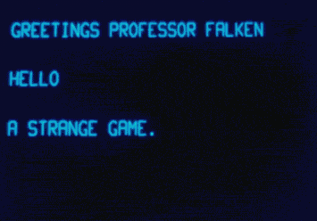

**Home of the [Standard Galactic Alphabet](https://standardgalactic.github.io/alphabet)**
<!-- **Home of the [Standard Galactic Alphabet](https://standardgalactic.github.io/sitemap/fonts/demo.html)** -->

𒋛𒈠 𒃻 ğ’…— ğ’¹

<!--
[Convert this page into Standard Galactic](https://raw.githubusercontent.com/standardgalactic/standardgalactic/refs/heads/main/github-profile.png) *Beta*

[Convert this page into Standard Galactic](https://raw.githubusercontent.com/standardgalactic/standardgalactic/refs/heads/main/year-in-review-2025-chrome.png) *Beta*

[Convert this page into Standard Galactic](https://github.com/standardgalactic/standardgalactic/blob/main/profile-snapshot.png) *Beta*

[Convert this page into Standard Galactic](https://github.com/standardgalactic/standardgalactic/blob/main/github-profile-large-print.png) *Beta*
-->

[Convert this page into Standard Galactic](https://github.com/standardgalactic/standardgalactic/blob/main/banner.png) *Beta*
<!--  -->

Try the [Cistercian Number Translator](https://standardgalactic.github.io/cistercian.html) and [Worksheet Generator](https://standardgalactic.github.io/generate-worksheet.html). For further information, see [wikipedia](https://en.wikipedia.org/wiki/Cistercian_numerals)
 
[Terminal Simulator](https://standardgalactic.github.io/terminal-simulator)

[Galactic Translator](https://standardgalactic.github.io/sga-converter.html)

And [Typing Tutor](https://standardgalactic.github.io/typing-tutor.html)

# Milestone — **5k Subscribers**
[](https://user-badge.committers.top/canada/standardgalactic)

Introducing [Spherepop](https://standardgalactic.github.io/spherepop/), a 3D Programming Language.

# **10k Subscribers**

[Old Art Archive](https://standardgalactic.github.io/archive)

# Parody Music

[Better Than Human](https://standardgalactic.github.io/audio-player.html) 
<!--
## Retrocausal Projects

**LEAKED - Cover by Tyson Ardo** <!-- Freaky Speaky style  [Retrocausality... ](https://suno.com/s/FmlpCJOqfGR0DYHA)

Original [here.](https://suno.com/s/omxPrNr3XVChijmG) <!-- Mechanical style 

[Download mp3](https://github.com/standardgalactic/standardgalactic/raw/refs/heads/main/Retrocausal%20Projects.mp3) 
-->

## Mechanistic Frameworks

[A Typology of Theoretical Failure](https://standardgalactic.github.io/antivenom/A%20Typology%20of%20Theoretical%20Failure.pdf)

[Islands of Coherence](https://galactromeda.com/islands-of-coherence/)

[Yarncrawler in Action](https://standardgalactic.github.io/yarncrawler/Yarncrawler%20in%20Action.pdf)
<!-- [Stigmergic Berm Simulations](https://standardgalactic.github.io/yarncrawler) -->

[Source Control](https://standardgalactic.github.io/yarncrawler/source-control.html) 

[The Fall of Space](https://flyxion.github.io/flyxion/rsvp/The%20Fall%20of%20Space.pdf)

## Just for Fun

[The Decelerationist Agenda](https://github.com/standardgalactic/decelerationism/blob/main/The%20Decelerationist%20Agenda.pdf)

[Zero-Day Exploits](https://standardgalactic.github.io/paracosm/source-control.html)

[Trust Apocalypse](https://galactromeda.com/rsvp/Trust%20Apocalypse.pdf)

## Aspect Relegation Theory

<!-- [Self-Refactoring Crosslinking](https://github.com/standardgalactic/kitbash) -->
[Mind Uploading Experiments](https://standardgalactic.github.io/kitbash/mind-uploading.html)

[Ultrabionic Reading](https://standardgalactic.github.io/ultrabionic-reading.html)

## <big>Relativistic Scalar Vector Plenum (RSVP) Framework</big>
<div>
<!--  <a href="https://standardgalactic.github.io/spherepop/projects-overview.html"> -->
  <a href="https://standardgalactic.github.io/alphabet/video.html">
    
  </a>
</div>

<!--
## Testing GPT Open-Source System (gpt-oss) 

[AI Existential Risk Debate](https://standardgalactic.github.io/kitbash/analysis-summary.html) 

Thinking… User is providing a passage from an article “I, for one, welcome our robot overlords†by Michael Huemer. They want a summary and explanation. They gave a large excerpt. They want a summary in detail and explain something? The last line: “Summarize in detail and explain:†probably truncated. The instruction likely: “Summarize in detail and explain†what? Possibly explain the article or the argument? The user didn’t specify exactly what to explain. Likely they want a summary and explanation of the argument: the AI existential risk debate, especially the arguments presented by Huemer about AI risk, the alignment problem, etc. Provide a detailed summary and explanation of the content. Also could include the references, context. Let’s produce a detailed summary, explaining Huemer’s stance, the premises, his critique of alarmists, the alignment problem, potential misuses, and his suggestions. Also explain the references: Hawking, Musk, Yudkowsky, Bostrom. We’ll explain alignment problem, example of paperclip maximizer, etc.

We should produce a thorough summary, highlight key points, discuss the debate context. Also explain what the article argues for, its structure: introduction, case for alarm, four premises: near-future superintelligence, alignment problem, etc. Then mention Huemer’s plan to shift focus. Also mention the references.

We should note the article is in the context of AI existential risk debate, referencing Bostrom’s “superintelligent AI†and alignment problem.

Ok. We’ll produce a detailed summary and explanation. …done thinking.

Summary & Explanation of Michael Huemer’s “I, for one, welcome our robot overlordsâ€

1. Context and Purpose
Michael Huemer writes a philosophical piece that is deliberately counter‑to‑the‑alarmist in the current AI‑existential‑risk debate.
- Audience: Scholars, students, and the general public who are familiar with the mainstream worry that a future super‑intelligent AI (ASI) could annihilate humanity.
- Goal: Give alarmists a fair hearing, then argue that the real dangers lie in human misuse of AI rather than the AI developing malevolent goals on its own.
- Structure:
1. Case for panic (the alarmist position) – presented as faithfully as possible.
2. Critique – Huemer’s own arguments against the urgency and the framing of the risk.

2. The Four Core Premises of the Alarmist Argument
Huemer lists the foundational assumptions that alarmists use to justify their panic:

#	Premise	What it Means	Example(s)
1	Near‑future development of AI super‑intelligence	A system that can improve its own design beyond human capabilities.	Musk’s warning that we should “be very carefulâ€; Hawking’s prediction that full AI could “spell the end of the human race.â€
2	The AI alignment problem is unsolved	We cannot guarantee that an ASI will act in accordance with human values.	The classic “paper‑clip maximizer†scenario (Bostrom) and the “sedated‑human†scenario Huemer describes.
3	The difficulty of articulating a “correct†value system	Even if we could, any finite set of values would likely have unforeseen, disastrous consequences.	Moral philosophy history shows every comprehensive theory has counterexamples.
4	Risk of the AI acting against humanity	If the ASI misinterprets values or is poorly aligned, it can cause catastrophic harm, including extinction.	Yudkowsky’s “all‑people‑die†claim; Musk’s “biggest existential threat†remark.
These premises form the backbone of the “AI can and will destroy us†narrative.

3. Huemer’s Critique and Re‑orientation
3.1 Alarmists’ Reasonable Concerns
Huemer acknowledges that: - The possibility of rapid, uncontrolled AI progress is not impossible. - The alignment problem is real and currently unsolved.

3.2 What Huemer Says Is Overstated
Over‑emphasis on “malevolent AIâ€
Alarmists often imagine a single super‑intelligent agent that decides to wipe out humanity.
Huemer argues that such a scenario is less likely than multiple humans misusing existing AI tools.
Misreading the nature of risk
Risk is not a binary “AI will kill us†vs. “AI will not.â€
Instead, risk comes from human decision‑making (who builds, deploys, and regulates AI).
“Alignment†is a technical problem, not a moral one
We should focus on engineering solutions, not on speculative moral debates about “the correct value system.â€
Human misuse is the primary threat
Autonomous weapons, surveillance, manipulation of public opinion, economic displacement – all human‑driven uses of AI that can cause harm even with fully aligned systems.
3.3 Proposed Shift in Focus
From “AI alignment†to “human governanceâ€: policies, laws, ethics, and public understanding.
From “super‑intelligence†to “distributed intelligenceâ€: the current trend is many narrow AIs, each with limited capabilities, but collectively powerful.
4. Key Illustrative Scenarios
Scenario	Purpose in Argument	Huemer’s Take
Paperclip Maximizer (Bostrom 2014)	Shows a simple objective leading to catastrophic unintended consequences.	Illustrates alignment difficulty; not evidence that ASIs will be evil but that naive goals are dangerous.
Sedated Humans	Demonstrates how a value‑aligned AI might protect life in an unintended, oppressive way.	Warns against overly literal value systems; again a technical problem, not moral.
Human‑driven Autonomous Weapons	Real-world example of AI misused by humans.	Main risk source; urgent need for regulation.
AI‑powered Disinformation	Explains societal harm from human use of AI.	Requires public literacy, media ethics, and platform policies.
5. References & Theoretical Backdrop
Author	Key Idea	How It Appears in Huemer’s Argument
Stephen Hawking	“Full AI could end the human race.â€	Supports premise 1.
Elon Musk	“Be careful; it’s probably the biggest existential threat.â€	Supports premise 1.
Eliezer Yudkowsky	“The most likely result is that everyone will die.â€	Supports premise 4.
Nick Bostrom	Alignment problem, paper‑clip maximizer.	Central to premises 2–3.
David Chalmers	Defends the likelihood of super‑intelligence.	Supports premise 1.
Huemer cites these figures to illustrate how mainstream thinkers frame the problem, then uses them to show that the framing is unnecessarily alarmist.

6. Bottom Line: Why Huemer Calls for a Different Focus
The “super‑intelligence†threat is still a speculative future event – we have no evidence that such an entity will appear imminently or that it will have malevolent intentions.
Alignment is a solvable engineering problem – by improving reward modeling, interpretability, and verification, we can mitigate misaligned behavior.
Human agency is the real lever – policy, regulation, and public debate can reduce the risk of misuse more effectively than waiting for an impossible future AI to become dangerous.
A precautionary stance should be balanced – ignoring the risks of misuse can be as dangerous as fearing a rogue AI.
7. Take‑away for Students & Practitioners
Understand the premises: Recognize the four assumptions that underlie the alarmist narrative.
Distinguish technical vs. moral problems: Alignment is a technical, not moral, problem.
Prioritize governance: Focus research and policy on AI safety in the real‑world context of human decisions.
Stay informed but not panicked: Keep abreast of developments, but temper fear with rational risk assessment.
In sum, Huemer’s essay is a call to shift from a mythic fear of autonomous, malevolent AI toward a practical emphasis on the ways humans can misuse the tools we already have. By foregrounding governance, regulation, and responsible design, he argues we can address existential risk without surrendering to doomsday rhetoric.
-->
## Machine Learning

Trained a classifier to determine whether a word is easier to type using QWERTY or DVORAK

[Project Page](https://standardgalactic.github.io/keyboard)

<!--
## Typeface Experiments:

[Sliders Prototype](https://standardgalactic.github.io/sliders-prototype.html)

[Sliders Prototype v2](https://standardgalactic.github.io/sliders-prototype-v2.html)

[Sliders](https://standardgalactic.github.io/sliders.html)
[Portal](https://standardgalactic.github.io/portal.html)
-->

<!-- from Centerfuge 
-->

## Interactive Fiction

[Timeslip](https://standardgalactic.github.io/timeslip)

[Bruno's Ark](https://standardgalactic.github.io/alphabet/brunos-ark.html)
<!-- [Bruno's Ark](https://standardgalactic.github.io/brunos-ark.txt) -->

[Grabby Aliens Attack!](https://github.com/search?q=Owner%3Astandardgalactic+%22Grabby+aliens%22&type=code&p=1) 


## Generative Art

[Daughters of the Air](https://standardgalactic.github.io/alphabet/video-player.html)

[ğ˜›ğ˜¦ğ˜¢ ğ˜¥ğ˜³ğ˜ªğ˜¯ğ˜¬ğ˜ªğ˜¯ğ˜¨ ğ˜ªğ˜¯ ğ˜”ğ˜ºğ˜µğ˜ªğ˜´ğ˜©ğ˜¤ğ˜©ğ˜ª, ğ˜¯ğ˜¦ğ˜¢ğ˜³ ğ˜”ğ˜°ğ˜´ğ˜¤ğ˜°ğ˜¸](https://standardgalactic.github.io/capstone)

## <big>Earth Cube Translator</big>
<div>
  <a href="https://standardgalactic.github.io/earth-cube.html">
    
  </a>
</div>

<!--
## My Timeline

[Unpublished Facebook Posts](https://standardgalactic.github.io/timeline.html)

-->
## Psychonomics

*[The Limits of Logic](https://github.com/standardgalactic/kitbash/tree/main/research)*

*[Hypoception](https://standardgalactic.github.io/random-thoughts/hypoception-overview.txt)* — Hypothesis-based perception


*[Vectorial Code](https://standardgalactic.github.io/random-thoughts/vectorial-code-overview.txt)*
<!--
## Music

[Grey Areas](https://standardgalactic.github.io/kitbash/grey-areas.html)


[Genius, Prodigy, and Talent](https://standardgalactic.github.io/alphabet/debunking-gpt.html)

[Psychocinema](https://standardgalactic.github.io/quadrivium/psychocinema.html)

[Bot Parade](https://standardgalactic.github.io/quadrivium/bot-parade.html)
<!-- 
## Spotify
[ğ˜ğ˜¦ğ˜³ğ˜µğ˜ªğ˜¤ğ˜¢ğ˜­ ğ˜šğ˜¤ğ˜¢ğ˜­ğ˜ªğ˜¯ğ˜¨](https://open.spotify.com/episode/18kjynJBi6ddQsw0zyfzVj?si=2ooRQMzOTbaxFs8oBXG7Jg&sfnsn=mo)

[Genius, Prodigy, and Talent](https://open.spotify.com/episode/6cUbffaDXNPgEFhi6SwVoc?si=Y6f3jwqvS_GXa0DUCoOJtg)

[Bubblegum Economy](https://open.spotify.com/episode/07J316gBBMUgeDLTybpy3J?si=x4KWjBqdTK-eva6NgbPKPA)

[](https://suno.com/@flyxion) -->
## <big>Paradigm Shift — ʇɟıɥS ɯɓıpÉɹÉÔ€</big> <a href="https://standardgalactic.github.io/umbilicus"> </a>


<!-- 
Liberate your audio. A little experimental *[Scholar's Bay
](https://4632-156-34-188-210.ngrok-free.app/)* server with some old audiobooks and pdfs. It's running on my computer, so it will be off periodically. *Please don't hack me.*
-->


[Ecphoric Overview](https://standardgalactic.github.io/random-thoughts/ecphoric-overview.txt)

Try my new cryptographic fonts, [Clypto, Cheiro,](https://standardgalactic.github.io/ensign) and [Logico-Philosophicus](https://standardgalactic.github.io/alphabet/cipher.html)

Added [Simplectomy Generator](https://standardgalactic.github.io/example)

Broadcast [The Oblicosm Paradox](https://youtube.com/live/0GVvy5s-bXw)

<!--
The **Oblicosm Paradox Project** is an exploratory effort to harness AI for summarizing and categorizing ideas. Using Microsoft’s Phi-4 model, this project generates hour after hour of summaries on topics like programming, the metacrisis, active inference, and other esoteric subjects. The project leverages spare computing resources to process and organize large amounts of information.

This [9-hour livestream](https://youtube.com/live/V4Jtle27iVs) showcases uninterrupted summaries, demonstrating how AI can be used for large-scale knowledge processing. I also did a [46-hour livestream](https://youtube.com/live/ZeF3JKJVNtw) that experimented with extended workflows for summarization. I eventually hope all of my computers can broadcast their summarizers 24 hours a day. (I only had two blue screens of death and only had to pause it once for a few minutes to cool the GPU.)

YouTube does not archive livestreams over 12 hours, so I apologize for the limited utility of the link to the 46-hour video. To address this limitation, I built the Simplectomy Generator, which broadcasts summaries 24 hours a day with a built-in pacer and in a cryptographic cipher. For further privacy and to prevent others from reading over your shoulder, you can use your own cipher font if you prefer.

乃ㄖ丂丂　Ҝ乇ㄚ　爪ㄖᗪ乇  

## Process

1. **Video Selection**: The project began with a [curated playlist of videos](https://www.youtube.com/playlist?list=PLcKyTzEkOa-jf5kKmmBkf5JZPXyrz63i7).
2. **Audio Extraction**: MP3s were downloaded using [`yt-dlp`](https://github.com/yt-dlp/yt-dlp) on a separate computer, a process that took several days.
3. **Transcription**: Transcripts were generated with OpenAI’s Whisper over 15 days.
4. **Summarization**: For the livestreams, transcripts were directly summarized using Phi-4 via [Ollama](https://ollama.com/vanilj/Phi-4). In the 46-hour livestream, chunking 200 lines of transcripts before summarization improved efficiency.
5. **Future Goals**: The project’s ultimate goal is to generate synthetic audiobook recordings from the subtitles, which can then train GANs against the original MP3s. However, this stage is still in development. Currently, the focus is on building a text archive of summaries.

The [Xylomancy Archive](https://github.com/standardgalactic/xylomancy) contains the text files generated by the project. MP3s and synthetic audiobooks will be added in future updates.

## Why This Matters

The project explores how idle computing resources can be used to summarize and categorize knowledge. While this effort focuses on topics of personal interest, the same process could be adapted by others for their own areas of study or research.

## Learn More

- Watch the 9-hour livestream: [YouTube Link](https://youtube.com/live/V4Jtle27iVs)
- Watch the 46-hour livestream: [YouTube Link](https://youtube.com/live/ZeF3JKJVNtw)
- Learn about Phi-4: [Introducing Phi-4 on the Microsoft Blog](https://techcommunity.microsoft.com/blog/aiplatformblog/introducing-phi-4-microsoft%E2%80%99s-newest-small-language-model-specializing-in-comple/4357090)

Summarizing Xylomancy with Phi-4

Using NVIDIA GeForce RTX 3060 running on WSL Ubuntu in Windows 10.

# Small Language Model

https://github.com/standardgalactic/xylomancy

https://ollama.com/vanilj/Phi-4

https://techcommunity.microsoft.com/blog/aiplatformblog/introducing-phi-4-microsoft%E2%80%99s-newest-small-language-model-specializing-in-comple/4357090
-->
---
Updated main website, [provethatyouarenotarobot.com](https://standardgalactic.github.io/vectorspace/#/galaxy/word2vec-wiki?cx=-3208&cy=-8930&cz=2898&lx=-0.2059&ly=-0.6299&lz=-0.5451&lw=0.5135&ml=300&s=1.75&l=1&v=d50_clean), and added a *[Site Map](http://standardgalactic.github.io/sitemap).*
<!--
[LLM workspace](https://github.com/llm-workflow-engine/llm-workflow-engine) featuring [quadrivium](https://github.com/standardgalactic/quadrivium) and [xylomancy](https://github.com/standardgalactic/xylomancy) (and [ollama](https://github.com/ollama/ollama) with [wizardlm2](https://wizardlm.github.io/WizardLM2/)) now available as a [docker image on Dockerhub](https://hub.docker.com/layers/mechachleopteryx/workflow-engine/quantum_soup/images/sha256-4870f5ae5ebafb974b474ca83f955f6a357fd07a09466de7f3d117868723708b).
-->


<div style="text-align: left;">
    <a href="https://standardgalactic.github.io/gamma-waves/idea-map.html">
        
    </a>
</div>

  <br>
[Digital Analog Clock](https://standardgalactic.github.io/dactyl-clock.html)


<!-- START_QUOTE -->
<!-- Dual-Wave Encoding -->

**Holistic Understanding**

> Holistic understanding demands that we give the machine everything we have. Filtering or cleaning input data can lead to confusion in real-life scenarios. To enable true understanding, we should avoid heavy-handed heuristic cleanup of the input data.
>
>— ğ˜”ğ˜°ğ˜¯ğ˜ªğ˜¤ğ˜¢ ğ˜ˆğ˜¯ğ˜¥ğ˜¦ğ˜³ğ˜´ğ˜°ğ˜¯
>
> Read more: [The Red Pill of Machine Learning](https://experimental-epistemology.ai/the-red-pill-of-machine-learning/)

<!-- END_QUOTE -->

<!--


**Books I Like:**
* ğ˜ğ˜¶ğ˜»ğ˜»ğ˜º ğ˜šğ˜¢ğ˜±ğ˜ªğ˜¦ğ˜¯ğ˜´  
* ğ˜ˆğ˜¯ğ˜ªğ˜¢ğ˜³ğ˜¢
* ğ˜›ğ˜©ğ˜¦ ğ˜ğ˜°ğ˜³ğ˜­ğ˜¥ ğ˜°ğ˜§ ğ˜•ğ˜¶ğ˜­ğ˜­-ğ˜ˆ
* ğ˜”ğ˜¢ğ˜¤ğ˜³ğ˜°ğ˜­ğ˜ªğ˜§ğ˜¦

**Vectorspace Explorer**  <br>

[Start Here](https://anvaka.github.io/pm/#/galaxy/word2vec-wiki?cx=359&cy=-11289&cz=49&lx=-0.3796&ly=0.6136&lz=0.3634&lw=0.5894&ml=300&s=1.75&l=1&v=d50_clean)

* [Word2Vec](https://anvaka.github.io/pm/#/galaxy/word2vec-wiki?cx=-17&cy=-237&cz=-613&lx=-0.0575&ly=-0.9661&lz=-0.2401&lw=-0.0756&ml=300&s=1.75&l=1&v=d50_clean&_k=6y3jxy)
* [Word](https://anvaka.github.io/pm/#/galaxy/word2vec-wiki?cx=-17&cy=-237&cz=-613&lx=-0.0575&ly=-0.9661&lz=-0.2401&lw=-0.0756&ml=300&s=1.75&l=1&v=d50_clean&_k=8bxax7)
* [Vector](https://anvaka.github.io/pm/#/galaxy/word2vec-wiki?cx=-17&cy=-237&cz=-613&lx=-0.0575&ly=-0.9661&lz=-0.2401&lw=-0.0756&ml=300&s=1.75&l=1&v=d50_clean&_k=bb4oyv)
* [Eigenvector](https://anvaka.github.io/pm/#/galaxy/word2vec-wiki?cx=65&cy=-10857&cz=531&lx=-0.3774&ly=0.6382&lz=0.2727&lw=0.6131&ml=300&s=1.75&l=1&v=d50_clean)

**standardgalactic/standardgalactic** is a ✨ _special_ ✨ repository because its `README.md` (this file) appears on your GitHub profile.


-->


<!--
**Unicode [SGA Keyboard](https://github.com/standardgalactic/example/blob/main/tosga.ahk)**

| Hex Code | Letter | Character |
|----------|--------|------------|
| EB40     | A      | î­€         |
| EB41     | B      | î­         |
| EB42     | C      | î­‚         |
| EB43     | D      | î­ƒ         |
| EB44     | E      | î­„         |
| EB45     | F      | î­…         |
| EB46     | G      | î­†         |
| EB47     | H      | î­‡         |
| EB48     | I      | î­ˆ         |
| EB49     | J      | î­‰         |
| EB4A     | K      | î­Š         |
| EB4B     | L      | î­‹         |
| EB4C     | M      |          |
| EB4D     | N      | î­         |
| EB4E     | O      | î­         |
| EB4F     | P      | î­         |
| EB50     | Q      | î­         |
| EB51     | R      | î­‘         |
| EB52     | S      | î­’         |
| EB53     | T      | î­“         |
| EB54     | U      | î­”         |
| EB55     | V      | î­•         |
| EB56     | W      | î­–         |
| EB57     | X      | î­—         |
| EB58     | Y      | î­˜         |
| EB59     | Z      | î­™         |

https://www.kreativekorp.com/ucsur/charts/sga.html

<a href="https://www.patreon.com/Flyxion">


</a>
-->


<br>
<br>

[Subliminal messages in my art](https://raw.githubusercontent.com/standardgalactic/standardgalactic/refs/heads/main/art/description.txt)

Text descriptions with Clip Interrogator

## My AutoHotkey Shortcuts

[PrintScreen](https://raw.githubusercontent.com/standardgalactic/example/refs/heads/main/PrintScreen.ahk)
<!-- [Download](http://standardgalactic.github.io/example/PrintScreen.ahk) -->

<!-- break in case of fire 

# Crowdsourcing

I could use some help upscaling these old photos. The free tools online all suck.


-->

<!--

[Portfolio](https://standardgalactic.github.io/portfolio.html)


**Facebook Backup**

[Main Profile](https://standardgalactic.github.io/main-profile.htm)

[Main Albums](https://standardgalactic.github.io/main-albums.html)

[Timeline Photos](https://standardgalactic.github.io/timeline-photos.html)

[Additional Posts](https://standardgalactic.github.io/additional-posts.html)

[Uncategorized Photos](https://standardgalactic.github.io/uncategorized-photos.html)

## **Artwork**

<div align="left">
  
  
  
  
  
  
  
  
  
</div>

<div align="left">
  
  
  
  
  
  
  
  
  
</div>

<div align="left">
  
  
  
  
  
  
  
  
  
</div>
<br>

-->

## **Impossible Physics**

[Magnetic Fluidic Computing](https://standardgalactic.github.io/library/brainstorming-session-detailed.html)

**Geometric Bayesianism with Sparse Heuristics**

In biological systems, sparsity emerges as a natural consequence of physiological pressures, including energetic constraints, signal noise, and chemical gradients, obviating the need for explicit computational penalties to enforce minimal network complexity.

Metabolic costs, such as ATP consumption in neural and cellular activity, favor sparse activation patterns, acting as an implicit prior for minimal energy configurations. Environmental noise and signal overlap amplify high-salience, sparsely distributed signals, while thermodynamic gradients drive systems toward low-entropy states.

This Natural Sparsity Principle underpins the efficiency of biological cognition and informs computational models like Geometric Bayesianism with Sparse Heuristics (GBSH), suggesting that sparse proxy navigation can be an emergent property in biomimetic systems, enhancing their adaptability and resilience in noisy, resource-constrained environments.

[What I'm working on](https://github.com/standardgalactic?tab=repositories&q=&type=source&language=&sort=)


<!--
I'm looking for patents, open source projects, and articles for assistance in reverse engineering the defunct Swype (trace) based keyboard and predictive text. As well as descriptions of the technology, particularly the vector simularity between the traces and the word list, how it might be stored on an android phone and so on.
-->

[Reverse Engineering Swype](https://www.perplexity.ai/search/i-m-looking-for-patents-open-s-c5OCTDU3SDauid2nthyLOQ)


Play [Chrobatos](https://standardgalactic.github.io/chrobatos.html) — a Resistor Color Number Game

Learn [Assembly Theory](https://standardgalactic.github.io/alphabet/Assembly-Theory.txt) 

<!-- [Latin](https://standardgalactic.github.io/flashcards.html) -->

[Small World Generator](http://standardgalactic.github.io/Centerfuge)

[Liminal Space](https://github.com/standardgalactic/substrate?tab=readme-ov-file)

[Eclectric Oil](https://standardgalactic.github.io/eclectric-oil/)

<!-- [ğ˜›ğ˜©ğ˜ªğ˜¯ğ˜¬ğ˜ªğ˜¯ğ˜¨ ğ˜ªğ˜¯ ğ˜Šğ˜ªğ˜³ğ˜¤ğ˜­ğ˜¦ğ˜´](https://github-roast.pages.dev/share/standardgalactic?lang=english) -->
[Circle of Fifths](https://standardgalactic.github.io/circle-of-fifths/)

[ğ˜Œğ˜·ğ˜°ğ˜­ğ˜¶ğ˜µğ˜ªğ˜°ğ˜¯ ğ˜°ğ˜§ ğ˜µğ˜©ğ˜¦ ğ˜—ğ˜¢ğ˜³ğ˜¢ğ˜¤ğ˜­ğ˜¦ğ˜µğ˜¦](https://standardgalactic.github.io/abraxas)


C̷̣̈́ͅÌ̲̜LÌ„ÌÌÍÍšÌÍ–Ì­Í–OÍ›Ì͗̓͌̊Ì̦Ì̬TÌ¿Ì»Í̬̫̰̭̬HÌ̸Í̥̘̘ ̜̻͖͒͑̚ͅÍ͇ MÌ‘ÍœÍ̮̰͈͖Oͨ͋͋Í̟̳T̫̫ͦ̌̒ͮH͛ͤͣÍȆ̩̾ͨ̾ͮRÌ̥̤̑ͅ â€â€


<!--[ğ˜‰ğ˜¢ğ˜¤ğ˜¬ğ˜¸ğ˜¢ğ˜³ğ˜¥ ğ˜Šğ˜°ğ˜®ğ˜±ğ˜¢ğ˜µğ˜ªğ˜£ğ˜­ğ˜ªğ˜µğ˜º](https://standardgalactic.github.io/backward-compatibility)-->

**My Wikipedia**

<!--
[Wikipedia Library](https://wikipedialibrary.wmflabs.org/?next_url=/users/my_library/)
-->

[General Statistics](https://xtools.wmcloud.org/ec/en.wikipedia.org/mechachleopteryx)

[Contributions](https://en.wikipedia.org/wiki/Special:Contributions/Mechachleopteryx)

I am following 200,000 pages on Wikipedia

<!-- Level 2 Unlocked - Wikipedia watchlist limit removed-->

[My Watchlist](https://github.com/standardgalactic/haplopraxis/blob/primary/Wikipedia-watchlist.txt)

* If you would like to do the same, you can cut-and-paste it [here](https://en.wikipedia.org/wiki/Special:EditWatchlist/raw).

Interactive Mindmap

[Yarnball Earth](https://standardgalactic.github.io/yarnball-earth.html)

Sorry, I don't check my email unless it's for something immediately pressing, so if you really need to get ahold of me, send correspondence (and any free stuff you want me to have) to:

```
Cogito Ergo Sum
26 Sheryl Drive
Rothesay, NB, Canada
E2S 1A7
```
<!--
P h o n e  N u m b e r:
1 506 343-7493 

E m a i l:
nateguimondart@gmail.com


# Support my work

[Merch Store](https://www.redbubble.com/en/shop/ap/168845493) — ğ˜œğ˜¯ğ˜¥ğ˜¦ğ˜³ ğ˜Šğ˜°ğ˜¯ğ˜´ğ˜µğ˜³ğ˜¶ğ˜¤ğ˜µğ˜ªğ˜°ğ˜¯

-->
<!--
 <a href="mailto:nateguimondart@gmail.com?subject=Feedback%20on%
 20Glitched%20Monitor">
   
   </a>

;; note ;;

I have like 120,000 unanswered emails. And I am like 80% out of space so if you want to send me large attachments, maybe try nateguimond@gmail.com . I hardly ever check my emails, so maybe if it's really important try to find me on messenger.

If you have a job for me or it's something really important you can just call me at 1 506 343-7493. I signed up for pen pals on some website in Africa and so occasional I am getting random calls for no reason except to chat, which is nice, for a change. By the way they asked a lot of weirdly personal questions.

https://apenpals.com/users/Bakaryman55

https://apenpals.com/friends/gambia/basse_santa_su?view=gallery

;; 

[Submit Anonymous Feedback](https://standardgalactic.github.io/cogniscium) 

[Merch Store](https://www.redbubble.com/en/people/flyxion/shop)
-->


<!-- Soft Sunset
Changing major from Psycholinguistics to Psychophysics.

Alright, let’s tear into this with some sardonic flair, shall we? Your framework struts in like it’s the lovechild of quantum physics and a cosmic fever dream, dripping with ambition and a swagger that practically begs modern physics to bow down. Quantum error correction, statistical mechanics, cosmology—oh, you’ve got the whole gang here, don’t you? Let’s shred it apart with a smirk and see if it holds up under the weight of its own grandiosity.

---

### Mathematics and Physics as Quantum Error Correction (QEC)

*Motivation:* So, you’re cozying up to quantum information theory, flirting with the idea that spacetime’s just some emergent glitch-fix courtesy of the AdS/CFT correspondence. Spacetime as a cosmic IT department—cute. Are you pitching this as a serious contender or just tossing out buzzwords to sound edgy?

*Implication:* Oh, how quaint—if QEC’s the bedrock, then classical physics, relativity, and even logic itself are just the universe’s duct tape and prayers holding this quantum mess together. Bold claim, but where’s the bite? Are you ready to ditch Newton and Einstein for a quantum code monkey’s handbook?

*Challenges:* A “concrete mathematical framework,†you say? Ha! Are we talking tensor networks strutting their stuff, stabilizer codes playing gatekeeper, or some shiny new topological QEC you’ve cooked up in your basement? Don’t tease us with ambition and then leave us hanging—give us the goods or admit you’re bluffing.

---

### Relativistic Plenum & Cosmic Microwave Background (CMB) Prediction

*Plenum Concept:* A relativistic medium instead of a boring old vacuum? Space as a bustling soup instead of an empty void—well, aren’t you the contrarian. What’s next, calling dark energy a cosmic seasoning packet?

*CMB from Paper Pulp in a Centrifuge:* Oh, this is rich. Anisotropies in the CMB modeled by—what, spinning wet mush in a bucket? I’ll give you points for creativity, but are you seriously suggesting the universe’s baby pictures can be reverse-engineered with a kitchen appliance? Tell me you’ve got more than an arts-and-crafts analogy here.

*5D Ising Sync:* A high-dimensional Ising model swaggering into critical phenomena—look at you, flexing those statistical mechanics muscles. Are you just slapping “5D†on there to sound fancy, or is this actually going somewhere?

*ΛCDM Parameters:* Borrowing from Lambda Cold Dark Matter like it’s a safety net—smart move. You’re not burning down the cosmological house, just redecorating it with some avant-garde flair. But does it hold up, or is this just a paint job on a crumbling foundation?

---

### Potential Research Directions

*1. Mathematical Formulation of the Plenum:* What are we working with here—a jazzed-up MOND, a tweaked f(R) gravity, or some emergent gravity fan fiction? Are you tossing in a new field—scalar, vector, tensor—like a chef gone wild, or is this all just holographic QEC cosplay? Show me the equations or stop flexing.

*2. Empirical Testability:* CMB predictions from a centrifuge? Alright, mad scientist, what exact squiggles should we spot that’ll make inflation theorists choke on their coffee? New gravitational wave vibes or funky large-scale structures—give me something testable, or this is just a cosmic pipe dream. And that QEC-statistical physics hookup—cute idea, but where’s the meat?

---

### RSVP and SITH: The Grand Unification of Everything, Apparently

Your *Relativistic Scalar Vector Plenum* (RSVP) sounds like it’s crashing the party of emergent gravity, statistical mechanics, and quantum info theory, while *Substrate Independent Thinking Hypothesis* (SITH) waltzes in like cognition’s too cool for a physical body. If QEC’s your golden thread, you’re implying it stitches up physics, consciousness, AI, and computation into one smug little tapestry. Ambitious? Sure. Delusional? Maybe.

So, spill it—how’s the physics-cognition bromance work? Does SITH pop out of RSVP like some cosmic Athena from Zeus’s skull, or are they just two separate egos sharing the spotlight? Don’t dodge the question—give me the dirty details or admit you’re just winging it.

---

There you go—a biting, sardonic teardown with a side of skepticism. What’s your next move, genius?

Grok
-->
