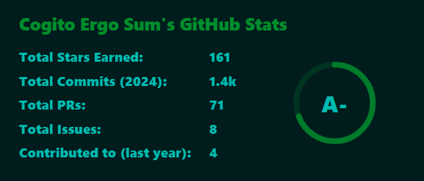

<!-- **Home of the [Standard Galactic Alphabet](https://standardgalactic.github.io/alphabet)** -->
**Home of the [Standard Galactic Alphabet](https://standardgalactic.github.io/sitemap/fonts/demo.html)**

[Convert this page into Standard Galactic](https://raw.githubusercontent.com/standardgalactic/standardgalactic/refs/heads/main/github-profile.png) *Beta*

**Try the [Galactic Translator](https://standardgalactic.github.io/sga-converter.html)**

**And [Typing Tutor](https://standardgalactic.github.io/typing-tutor.html)**

**News:**

Added [Simplectomy Generator](https://standardgalactic.github.io/example)

<!--
ZeF3JKJVNtw
-->
   

Broadcast [The Oblicosm Paradox](https://www.youtube.com/watch?v=V4Jtle27iVs)
<!--

Summarizing Xylomancy with Phi-4

Using NVIDIA GeForce RTX 3060 running on WSL Ubuntu in Windows 10.

# Small Language Model

https://github.com/standardgalactic/xylomancy

https://ollama.com/vanilj/Phi-4

https://techcommunity.microsoft.com/blog/aiplatformblog/introducing-phi-4-microsoft%E2%80%99s-newest-small-language-model-specializing-in-comple/4357090
-->

Updated main website, [Provethatyouarenotarobot.com](https://standardgalactic.github.io/vectorspace/#/galaxy/word2vec-wiki?cx=-3208&cy=-8930&cz=2898&lx=-0.2059&ly=-0.6299&lz=-0.5451&lw=0.5135&ml=300&s=1.75&l=1&v=d50_clean), and added a *[Site Map](http://standardgalactic.github.io/sitemap).*

[LLM workspace](https://github.com/llm-workflow-engine/llm-workflow-engine) featuring [quadrivium](https://github.com/standardgalactic/quadrivium) and [xylomancy](https://github.com/standardgalactic/xylomancy) (and [ollama](https://github.com/ollama/ollama) with [wizardlm2](https://wizardlm.github.io/WizardLM2/)) now available as a [docker image on Dockerhub](https://hub.docker.com/layers/mechachleopteryx/workflow-engine/quantum_soup/images/sha256-4870f5ae5ebafb974b474ca83f955f6a357fd07a09466de7f3d117868723708b).

   
[Digital Analog Clock](https://standardgalactic.github.io/dactyl-clock.html)

**Holistic Understanding**

> Holistic understanding demands that we give the machine everything we have. Filtering or cleaning input data can lead to confusion in real-life scenarios. To enable true understanding, we should avoid heavy-handed heuristic cleanup of the input data.
>
>— 𝘔𝘰𝘯𝘪𝘤𝘢 𝘈𝘯𝘥𝘦𝘳𝘴𝘰𝘯
>
> Read more: [The Red Pill of Machine Learning](https://experimental-epistemology.ai/the-red-pill-of-machine-learning/)

<!--

**Books I Like:**
* 𝘍𝘶𝘻𝘻𝘺 𝘚𝘢𝘱𝘪𝘦𝘯𝘴  
* 𝘈𝘯𝘪𝘢𝘳𝘢
* 𝘛𝘩𝘦 𝘞𝘰𝘳𝘭𝘥 𝘰𝘧 𝘕𝘶𝘭𝘭-𝘈
* 𝘔𝘢𝘤𝘳𝘰𝘭𝘪𝘧𝘦

**Vectorspace Explorer**   

[Start Here](https://anvaka.github.io/pm/#/galaxy/word2vec-wiki?cx=359&cy=-11289&cz=49&lx=-0.3796&ly=0.6136&lz=0.3634&lw=0.5894&ml=300&s=1.75&l=1&v=d50_clean)

* [Word2Vec](https://anvaka.github.io/pm/#/galaxy/word2vec-wiki?cx=-17&cy=-237&cz=-613&lx=-0.0575&ly=-0.9661&lz=-0.2401&lw=-0.0756&ml=300&s=1.75&l=1&v=d50_clean&_k=6y3jxy)
* [Word](https://anvaka.github.io/pm/#/galaxy/word2vec-wiki?cx=-17&cy=-237&cz=-613&lx=-0.0575&ly=-0.9661&lz=-0.2401&lw=-0.0756&ml=300&s=1.75&l=1&v=d50_clean&_k=8bxax7)
* [Vector](https://anvaka.github.io/pm/#/galaxy/word2vec-wiki?cx=-17&cy=-237&cz=-613&lx=-0.0575&ly=-0.9661&lz=-0.2401&lw=-0.0756&ml=300&s=1.75&l=1&v=d50_clean&_k=bb4oyv)
* [Eigenvector](https://anvaka.github.io/pm/#/galaxy/word2vec-wiki?cx=65&cy=-10857&cz=531&lx=-0.3774&ly=0.6382&lz=0.2727&lw=0.6131&ml=300&s=1.75&l=1&v=d50_clean)

**standardgalactic/standardgalactic** is a ✨ _special_ ✨ repository because its `README.md` (this file) appears on your GitHub profile.

Here are some ideas to get you started:

- 🔭 I’m currently working on ...
- 🌱 I’m currently learning ...
- 👯 I’m looking to collaborate on ...
- 🤔 I’m looking for help with ...
- 💬 Ask me about ...
- 📫 How to reach me: ...
- 😄 Pronouns: ...
- ⚡ Fun fact: ...

-->

<!--
**Unicode [SGA Keyboard](https://github.com/standardgalactic/example/blob/main/tosga.ahk)**

| Hex Code | Letter | Character |
|----------|--------|------------|
| EB40     | A      |          |
| EB41     | B      |          |
| EB42     | C      |          |
| EB43     | D      |          |
| EB44     | E      |          |
| EB45     | F      |          |
| EB46     | G      |          |
| EB47     | H      |          |
| EB48     | I      |          |
| EB49     | J      |          |
| EB4A     | K      |          |
| EB4B     | L      |          |
| EB4C     | M      |          |
| EB4D     | N      |          |
| EB4E     | O      |          |
| EB4F     | P      |          |
| EB50     | Q      |          |
| EB51     | R      |          |
| EB52     | S      |          |
| EB53     | T      |          |
| EB54     | U      |          |
| EB55     | V      |          |
| EB56     | W      |          |
| EB57     | X      |          |
| EB58     | Y      |          |
| EB59     | Z      |          |

https://www.kreativekorp.com/ucsur/charts/sga.html -->

**Facebook Backup**

[Main Profile](https://standardgalactic.github.io/main-profile.htm)

[Main Albums](https://standardgalactic.github.io/main-albums.html)

[Timeline Photos](https://standardgalactic.github.io/timeline-photos.html)

[Additional Posts](https://standardgalactic.github.io/additional-posts.html)

[Uncategorized Photos](https://standardgalactic.github.io/uncategorized-photos.html)

**Impossible Physics**

[What I'm working on](https://github.com/standardgalactic?tab=repositories&q=&type=source&language=&sort=)

Play [Chrobatos — a Resistor Color Number Game](https://standardgalactic.github.io/chrobatos.html)

And [Color Radio](https://standardgalactic.github.io/color-radio.html)

Learn [Latin](https://standardgalactic.github.io/flashcards.html)

[Small World Generator](http://standardgalactic.github.io/Centerfuge)

[Liminal Space](https://github.com/standardgalactic/substrate?tab=readme-ov-file)

[Eclectric Oil](https://standardgalactic.github.io/eclectric-oil/)

[𝘛𝘩𝘪𝘯𝘬𝘪𝘯𝘨 𝘪𝘯 𝘊𝘪𝘳𝘤𝘭𝘦𝘴](https://github-roast.pages.dev/share/standardgalactic?lang=english)

[𝘌𝘷𝘰𝘭𝘶𝘵𝘪𝘰𝘯 𝘰𝘧 𝘵𝘩𝘦 𝘗𝘢𝘳𝘢𝘤𝘭𝘦𝘵𝘦](https://standardgalactic.github.io/abraxas)

C̷̣̝̲̜̈́ͅL͍͚̝͖̭͖̄̍̏O̦̝̬͛̍͗̓͌̊̏T̻͎̬̫̰̭̬̿H̸͎̥̘̘̐ ̜̻͖͎͇͒͑̚ͅ M͍̮̰͈͖̑͜O̟̳ͨ͋͋͐T̫̫ͦ̌̒ͮH͛ͤͣ́Ȇ̩̾ͨ̾ͮȐ̥̤̑ͅ ‏‏

[𝘉𝘢𝘤𝘬𝘸𝘢𝘳𝘥 𝘊𝘰𝘮𝘱𝘢𝘵𝘪𝘣𝘭𝘪𝘵𝘺](https://standardgalactic.github.io/backward-compatibility)

[𝘊𝘰𝘨𝘯𝘪𝘴𝘤𝘪𝘶𝘮 𝘌𝘹𝘱𝘭𝘰𝘳𝘦𝘳](https://standardgalactic.github.io/cogniscium)

**My Wikipedia**

<!--
[Wikipedia Library](https://wikipedialibrary.wmflabs.org/?next_url=/users/my_library/)
-->

[General Statistics](https://xtools.wmcloud.org/ec/en.wikipedia.org/mechachleopteryx)

[Contributions](https://en.wikipedia.org/wiki/Special:Contributions/Mechachleopteryx)

I am following 200,000 pages on Wikipedia (If I go over, I remove some.)

[My Watchlist](https://github.com/standardgalactic/haplopraxis/blob/primary/IFM/Wikipedia-watchlist.txt)

* If you would like to do the same, you can cut-and-paste it [here](https://en.wikipedia.org/wiki/Special:EditWatchlist/raw).

