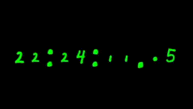

<!-- **Home of the [Standard Galactic Alphabet](https://standardgalactic.github.io/alphabet)** -->
**Home of the [Standard Galactic Alphabet](https://standardgalactic.github.io/sitemap/fonts/demo.html)**

𒋛𒈠 𒃻 𒅗 𒁹
<!--
[Convert this page into Standard Galactic](https://raw.githubusercontent.com/standardgalactic/standardgalactic/refs/heads/main/github-profile.png) *Beta*

[Convert this page into Standard Galactic](https://raw.githubusercontent.com/standardgalactic/standardgalactic/refs/heads/main/year-in-review-2025-chrome.png) *Beta*
-->
[Convert this page into Standard Galactic](https://raw.githubusercontent.com/standardgalactic/standardgalactic/refs/heads/main/profile-key.png) *Beta*

**Try the [Galactic Translator](https://standardgalactic.github.io/sga-converter.html)**

**And [Typing Tutor](https://standardgalactic.github.io/typing-tutor.html)**

<!--
# **Updates:**
[Gameified Altruism](https://standardgalactic.github.io/experiments)

[Haplopraxis](https://www.youtube.com/live/0GVvy5s-bXw)
-->
## Music

[Psychocinema](https://standardgalactic.github.io/quadrivium/psychocinema.html)

[Bot Parade](https://standardgalactic.github.io/quadrivium/bot-parade.html)

## Piracy 
<!--
- This might be completely useless to anyone but me but I started a little *[Scholar's Bay](https://acbb-159-2-201-107.ngrok-free.app/)* server running on my computer with some old audiobooks and pdfs. It's running on a server on my computer so *please don't hack me.*
-->

Try my new cryptographic fonts, [Clypto, Cheiro,](https://standardgalactic.github.io/ensign) and [Logico-Philosophicus](https://standardgalactic.github.io/alphabet/cipher.html)

Added [Simplectomy Generator](https://standardgalactic.github.io/example)

Broadcast [The Oblicosm Paradox](https://youtube.com/live/0GVvy5s-bXw)

<!--
The **Oblicosm Paradox Project** is an exploratory effort to harness AI for summarizing and categorizing ideas. Using Microsoft’s Phi-4 model, this project generates hour after hour of summaries on topics like programming, the metacrisis, active inference, and other esoteric subjects. The project leverages spare computing resources to process and organize large amounts of information.

This [9-hour livestream](https://youtube.com/live/V4Jtle27iVs) showcases uninterrupted summaries, demonstrating how AI can be used for large-scale knowledge processing. I also did a [46-hour livestream](https://youtube.com/live/ZeF3JKJVNtw) that experimented with extended workflows for summarization. I eventually hope all of my computers can broadcast their summarizers 24 hours a day. (I only had two blue screens of death and only had to pause it once for a few minutes to cool the GPU.)

YouTube does not archive livestreams over 12 hours, so I apologize for the limited utility of the link to the 46-hour video. To address this limitation, I built the Simplectomy Generator, which broadcasts summaries 24 hours a day with a built-in pacer and in a cryptographic cipher. For further privacy and to prevent others from reading over your shoulder, you can use your own cipher font if you prefer. <!-- 乃ㄖ丂丂　Ҝ乇ㄚ　爪ㄖᗪ乇 -->  

<!--
## Process

1. **Video Selection**: The project began with a [curated playlist of videos](https://www.youtube.com/playlist?list=PLcKyTzEkOa-jf5kKmmBkf5JZPXyrz63i7).
2. **Audio Extraction**: MP3s were downloaded using [`yt-dlp`](https://github.com/yt-dlp/yt-dlp) on a separate computer, a process that took several days.
3. **Transcription**: Transcripts were generated with OpenAI’s Whisper over 15 days.
4. **Summarization**: For the livestreams, transcripts were directly summarized using Phi-4 via [Ollama](https://ollama.com/vanilj/Phi-4). In the 46-hour livestream, chunking 200 lines of transcripts before summarization improved efficiency.
5. **Future Goals**: The project’s ultimate goal is to generate synthetic audiobook recordings from the subtitles, which can then train GANs against the original MP3s. However, this stage is still in development. Currently, the focus is on building a text archive of summaries.

The [Xylomancy Archive](https://github.com/standardgalactic/xylomancy) contains the text files generated by the project. MP3s and synthetic audiobooks will be added in future updates.

## Why This Matters

The project explores how idle computing resources can be used to summarize and categorize knowledge. While this effort focuses on topics of personal interest, the same process could be adapted by others for their own areas of study or research.

## Learn More

- Watch the 9-hour livestream: [YouTube Link](https://youtube.com/live/V4Jtle27iVs)
- Watch the 46-hour livestream: [YouTube Link](https://youtube.com/live/ZeF3JKJVNtw)
- Learn about Phi-4: [Introducing Phi-4 on the Microsoft Blog](https://techcommunity.microsoft.com/blog/aiplatformblog/introducing-phi-4-microsoft%E2%80%99s-newest-small-language-model-specializing-in-comple/4357090)

Summarizing Xylomancy with Phi-4

Using NVIDIA GeForce RTX 3060 running on WSL Ubuntu in Windows 10.

# Small Language Model

https://github.com/standardgalactic/xylomancy

https://ollama.com/vanilj/Phi-4

https://techcommunity.microsoft.com/blog/aiplatformblog/introducing-phi-4-microsoft%E2%80%99s-newest-small-language-model-specializing-in-comple/4357090
-->
---
Updated main website, [provethatyouarenotarobot.com](https://standardgalactic.github.io/vectorspace/#/galaxy/word2vec-wiki?cx=-3208&cy=-8930&cz=2898&lx=-0.2059&ly=-0.6299&lz=-0.5451&lw=0.5135&ml=300&s=1.75&l=1&v=d50_clean), and added a *[Site Map](http://standardgalactic.github.io/sitemap).*

[LLM workspace](https://github.com/llm-workflow-engine/llm-workflow-engine) featuring [quadrivium](https://github.com/standardgalactic/quadrivium) and [xylomancy](https://github.com/standardgalactic/xylomancy) (and [ollama](https://github.com/ollama/ollama) with [wizardlm2](https://wizardlm.github.io/WizardLM2/)) now available as a [docker image on Dockerhub](https://hub.docker.com/layers/mechachleopteryx/workflow-engine/quantum_soup/images/sha256-4870f5ae5ebafb974b474ca83f955f6a357fd07a09466de7f3d117868723708b).

   
[Digital Analog Clock](https://standardgalactic.github.io/dactyl-clock.html)

**Holistic Understanding**

> Holistic understanding demands that we give the machine everything we have. Filtering or cleaning input data can lead to confusion in real-life scenarios. To enable true understanding, we should avoid heavy-handed heuristic cleanup of the input data.
>
>— 𝘔𝘰𝘯𝘪𝘤𝘢 𝘈𝘯𝘥𝘦𝘳𝘴𝘰𝘯
>
> Read more: [The Red Pill of Machine Learning](https://experimental-epistemology.ai/the-red-pill-of-machine-learning/)

<!--

**Books I Like:**
* 𝘍𝘶𝘻𝘻𝘺 𝘚𝘢𝘱𝘪𝘦𝘯𝘴  
* 𝘈𝘯𝘪𝘢𝘳𝘢
* 𝘛𝘩𝘦 𝘞𝘰𝘳𝘭𝘥 𝘰𝘧 𝘕𝘶𝘭𝘭-𝘈
* 𝘔𝘢𝘤𝘳𝘰𝘭𝘪𝘧𝘦

**Vectorspace Explorer**   

[Start Here](https://anvaka.github.io/pm/#/galaxy/word2vec-wiki?cx=359&cy=-11289&cz=49&lx=-0.3796&ly=0.6136&lz=0.3634&lw=0.5894&ml=300&s=1.75&l=1&v=d50_clean)

* [Word2Vec](https://anvaka.github.io/pm/#/galaxy/word2vec-wiki?cx=-17&cy=-237&cz=-613&lx=-0.0575&ly=-0.9661&lz=-0.2401&lw=-0.0756&ml=300&s=1.75&l=1&v=d50_clean&_k=6y3jxy)
* [Word](https://anvaka.github.io/pm/#/galaxy/word2vec-wiki?cx=-17&cy=-237&cz=-613&lx=-0.0575&ly=-0.9661&lz=-0.2401&lw=-0.0756&ml=300&s=1.75&l=1&v=d50_clean&_k=8bxax7)
* [Vector](https://anvaka.github.io/pm/#/galaxy/word2vec-wiki?cx=-17&cy=-237&cz=-613&lx=-0.0575&ly=-0.9661&lz=-0.2401&lw=-0.0756&ml=300&s=1.75&l=1&v=d50_clean&_k=bb4oyv)
* [Eigenvector](https://anvaka.github.io/pm/#/galaxy/word2vec-wiki?cx=65&cy=-10857&cz=531&lx=-0.3774&ly=0.6382&lz=0.2727&lw=0.6131&ml=300&s=1.75&l=1&v=d50_clean)

**standardgalactic/standardgalactic** is a ✨ _special_ ✨ repository because its `README.md` (this file) appears on your GitHub profile.

Here are some ideas to get you started:

- 🔭 I’m currently working on ...
- 🌱 I’m currently learning ...
- 👯 I’m looking to collaborate on ...
- 🤔 I’m looking for help with ...
- 💬 Ask me about ...
- 📫 How to reach me: ...
- 😄 Pronouns: ...
- ⚡ Fun fact: ...

-->

<!--
**Unicode [SGA Keyboard](https://github.com/standardgalactic/example/blob/main/tosga.ahk)**

| Hex Code | Letter | Character |
|----------|--------|------------|
| EB40     | A      |          |
| EB41     | B      |          |
| EB42     | C      |          |
| EB43     | D      |          |
| EB44     | E      |          |
| EB45     | F      |          |
| EB46     | G      |          |
| EB47     | H      |          |
| EB48     | I      |          |
| EB49     | J      |          |
| EB4A     | K      |          |
| EB4B     | L      |          |
| EB4C     | M      |          |
| EB4D     | N      |          |
| EB4E     | O      |          |
| EB4F     | P      |          |
| EB50     | Q      |          |
| EB51     | R      |          |
| EB52     | S      |          |
| EB53     | T      |          |
| EB54     | U      |          |
| EB55     | V      |          |
| EB56     | W      |          |
| EB57     | X      |          |
| EB58     | Y      |          |
| EB59     | Z      |          |

https://www.kreativekorp.com/ucsur/charts/sga.html
 -->

 

**My Timeline**

[Portfolio](https://standardgalactic.github.io/portfolio.html)

<!--[Unpublished Facebook Posts](https://standardgalactic.github.io/timeline.html)-->

<!--
**Facebook Backup**

[Main Profile](https://standardgalactic.github.io/main-profile.htm)

[Main Albums](https://standardgalactic.github.io/main-albums.html)

[Timeline Photos](https://standardgalactic.github.io/timeline-photos.html)

[Additional Posts](https://standardgalactic.github.io/additional-posts.html)

[Uncategorized Photos](https://standardgalactic.github.io/uncategorized-photos.html)
-->
**Impossible Physics**

[What I'm working on](https://github.com/standardgalactic?tab=repositories&q=&type=source&language=&sort=)

Play [Chrobatos — a Resistor Color Number Game](https://standardgalactic.github.io/chrobatos.html)

And [Color Radio](https://standardgalactic.github.io/color-radio.html)

Learn [Latin](https://standardgalactic.github.io/flashcards.html)

[Small World Generator](http://standardgalactic.github.io/Centerfuge)

[Liminal Space](https://github.com/standardgalactic/substrate?tab=readme-ov-file)

[Eclectric Oil](https://standardgalactic.github.io/eclectric-oil/)

[𝘛𝘩𝘪𝘯𝘬𝘪𝘯𝘨 𝘪𝘯 𝘊𝘪𝘳𝘤𝘭𝘦𝘴](https://github-roast.pages.dev/share/standardgalactic?lang=english)

[𝘌𝘷𝘰𝘭𝘶𝘵𝘪𝘰𝘯 𝘰𝘧 𝘵𝘩𝘦 𝘗𝘢𝘳𝘢𝘤𝘭𝘦𝘵𝘦](https://standardgalactic.github.io/abraxas)

C̷̣̝̲̜̈́ͅL͍͚̝͖̭͖̄̍̏O̦̝̬͛̍͗̓͌̊̏T̻͎̬̫̰̭̬̿H̸͎̥̘̘̐ ̜̻͖͎͇͒͑̚ͅ M͍̮̰͈͖̑͜O̟̳ͨ͋͋͐T̫̫ͦ̌̒ͮH͛ͤͣ́Ȇ̩̾ͨ̾ͮȐ̥̤̑ͅ ‏‏

<!--[𝘉𝘢𝘤𝘬𝘸𝘢𝘳𝘥 𝘊𝘰𝘮𝘱𝘢𝘵𝘪𝘣𝘭𝘪𝘵𝘺](https://standardgalactic.github.io/backward-compatibility)-->
[𝘊𝘰𝘨𝘯𝘪𝘴𝘤𝘪𝘶𝘮 𝘌𝘹𝘱𝘭𝘰𝘳𝘦𝘳](https://standardgalactic.github.io/cogniscium)

**My Wikipedia**

<!--
[Wikipedia Library](https://wikipedialibrary.wmflabs.org/?next_url=/users/my_library/)
-->

[General Statistics](https://xtools.wmcloud.org/ec/en.wikipedia.org/mechachleopteryx)

[Contributions](https://en.wikipedia.org/wiki/Special:Contributions/Mechachleopteryx)

I am following 200,000 pages on Wikipedia (If I go over, I remove some.)

[My Watchlist](https://github.com/standardgalactic/haplopraxis/blob/primary/IFM/Wikipedia-watchlist.txt)

* If you would like to do the same, you can cut-and-paste it [here](https://en.wikipedia.org/wiki/Special:EditWatchlist/raw).

# Support my work

 

