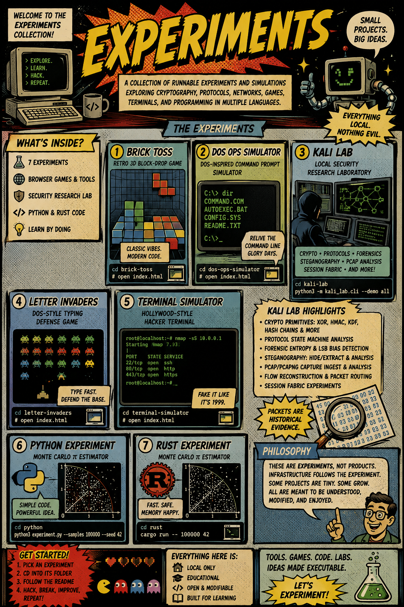

# Experiments

A collection of runnable experiments and simulations exploring cryptography, protocol analysis, network reconstruction, retrocomputing, games, terminal interfaces, and small programs in multiple languages.

The projects in this directory are intentionally self-contained. Each experiment should be understandable and runnable without requiring the rest of the repository. Browser-based projects can generally be launched by opening their `index.html` files directly, while Python and Rust experiments use their respective runtimes and toolchains.

```text
.
├── brick-toss/
│   ├── README.md
│   ├── brick-toss.css
│   ├── brick-toss.js
│   └── index.html
├── dos-ops-simulator/
│   ├── README.md
│   ├── dos-ops-simulator.css
│   ├── dos-ops-simulator.js
│   └── index.html
├── kali-lab/
│   ├── LAB_NOTES.md
│   ├── README.md
│   ├── THREAT_MODEL.md
│   ├── docs/
│   ├── fixtures/
│   ├── kali_lab/
│   ├── requirements.txt
│   └── tests/
├── letter-invaders/
│   ├── README.md
│   ├── index.html
│   ├── letter-invaders.css
│   └── letter-invaders.js
├── python/
│   ├── README.md
│   ├── experiment.py
│   └── requirements.txt
├── rust/
│   ├── Cargo.lock
│   ├── Cargo.toml
│   ├── README.md
│   └── src/
│       └── main.rs
└── terminal-simulator/
    ├── README.md
    ├── index.html
    ├── terminal-simulator.css
    └── terminal-simulator.js
```

## Brick Toss

Brick Toss is a single-page retro 3D block-drop game built with HTML, CSS, and JavaScript. It explores how much spatial interaction and game logic can be packed into a small browser-native project without introducing a framework or build system.

From this directory:

```bash
cd brick-toss
```

Then open `index.html` in a browser.

## DOS Ops Simulator

DOS Ops Simulator is a DOS-inspired command-line simulation providing a small interactive environment modeled after classic text-mode computing. It treats the terminal itself as the experimental surface, combining command parsing, simulated system behavior, and a deliberately constrained retro interface.

```bash
cd dos-ops-simulator
```

Then open `index.html` in a browser.

## Kali Lab

Kali Lab is the largest experiment in the collection. It is a local security-research laboratory for studying cryptography, protocols, packet captures, forensic evidence, steganography, flow reconstruction, and session behavior in a controlled environment.

Run the demonstration suite with:

```bash
cd kali-lab
python3 -m kali_lab.cli --demo all
```

The laboratory includes experiments with cryptographic primitives such as XOR operations, HMACs, key-derivation functions, and hash chains; protocol state-machine analysis; forensic entropy and LSB-bias analysis; image steganography; PCAP and PCAPNG ingestion; packet and flow analysis; flow reconstruction; packet routing; and an experimental session fabric.

The network-analysis path follows a recurring principle: begin with fragmentary observations and progressively reconstruct the higher-level structures that could have produced them.

```text
capture
   ↓
ingestion
   ↓
normalization
   ↓
packet and flow models
   ↓
analysis
   ↓
flow reconstruction
   ↓
session reconstruction
   ↓
transport and session experiments
```

This makes Kali Lab less a collection of isolated security utilities than an experiment in reconstructing computational history from partial evidence. A packet is an observation rather than a session; a flow is an inferred relationship rather than an application; and a reconstructed session remains a model whose adequacy can be compared against controlled ground truth.

The `fixtures/` directory contains challenge vectors, malformed inputs, protocol transcripts, and packet captures intended for deterministic and repeatable local experiments. The `tests/` directory exercises the cryptographic, protocol, capture-analysis, session-fabric, steganographic, and local-network-boundary components.

See `kali-lab/README.md`, `kali-lab/THREAT_MODEL.md`, and `kali-lab/LAB_NOTES.md` for the laboratory's detailed scope, assumptions, and constraints.

## Letter Invaders

Letter Invaders is a DOS-style typing game combining keyboard practice with a simple arcade-defense mechanic. It uses a deliberately small browser implementation to explore the intersection of input speed, visual feedback, and game state.

```bash
cd letter-invaders
```

Then open `index.html` in a browser.

## Terminal Simulator

Terminal Simulator is a deliberately theatrical command-line simulation inspired by cinematic terminals, retrocomputers, and fictional depictions of interactive computer systems.

Rather than attempting to reproduce a particular historical operating system exactly, it treats the imagined terminal as an interface genre in its own right.

```bash
cd terminal-simulator
```

Then open `index.html` in a browser.

## Python Experiment

The Python experiment is a compact Monte Carlo program for estimating π.

```bash
cd python
python3 experiment.py --samples 100000 --seed 42
```

The explicit seed makes runs reproducible, allowing results and implementation behavior to be compared across repeated executions.

## Rust Experiment

The Rust experiment implements the same Monte Carlo π estimation problem as the Python version, packaged as a conventional Cargo project.

```bash
cd rust
cargo run -- 100000 42
```

Together, the Python and Rust implementations form a deliberately small comparative experiment. The underlying algorithm remains essentially unchanged while the language, runtime, type system, compilation model, project structure, and tooling change around it.

The point is therefore not π itself. The estimate provides a stable computational object against which two implementation environments can be compared.

## Philosophy

These projects are experiments rather than products. Their purpose is to make ideas executable with as little surrounding machinery as the idea actually requires.

Some experiments are deliberately tiny: an HTML document, a stylesheet, and a JavaScript program may constitute the entire system. Others are small command-line programs designed to expose one algorithm or implementation choice without hiding it behind an application architecture. Kali Lab is permitted to grow considerably larger because the object of the experiment—reconstructing cryptographic, packet, flow, and session behavior—requires persistent models, fixtures, tests, and explicit boundaries.

The distinction is important. Self-contained does not necessarily mean small, and experimental does not necessarily mean disposable. An experiment should contain enough machinery to make its assumptions visible, its behavior reproducible, and its failures inspectable, but no more machinery merely for the appearance of being a finished software product.

This leads to the organizing principle of the directory:

> **Infrastructure should follow the experiment rather than precede it.**

A browser game does not need a deployment platform merely because one exists. A Monte Carlo calculation does not need an application framework. A packet-analysis laboratory, conversely, should not be forced into artificial minimalism when fixtures, state machines, threat models, and reproducible tests are themselves part of what is being investigated.

Across the directory, the experiments therefore vary substantially in size while retaining the same basic orientation: construct the smallest executable environment in which the interesting question becomes observable.

For the broader context behind the security experiments, see [Microsecurity for Microprofessionals](https://standardgalactic.github.io/repair-preserves-difference/microsecurity-for-microprofessionals.pdf).


