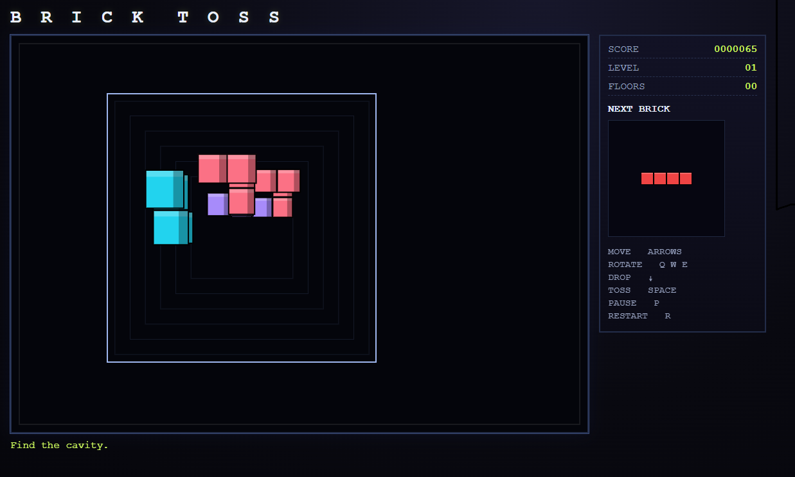

# Brick Toss

Retro single-page 3D brick puzzle inspired by the "look down into a well" style.

- Well size: **5 × 5 × 12**
- Coordinates: **well[z][y][x]**
- Gravity: **+Z**
- Soft drop: **Arrow Down** (+1 point per descended cell)
- Toss: **Space** (+2 points per descended cell)

## Run

Open `experiments/brick-toss/index.html` in a browser.

No build step is required.

